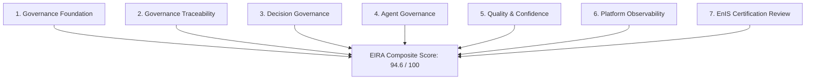

# EIRA_REPORT.md — Enterprise Governance Readiness Assessment

> **Relatório Executivo de Diagnóstico Arquitetural Inter-Waves (Wave 14 $\rightarrow$ Wave 15)**  
> *Autoridade: Architecture Review Board (ARB) & Illumine OS Executive Advisory*  
> *Status do Veredito: **GO (APROVADO PARA WAVE 15)** com Trava de Autonomia Inicial em Nível 2 (Recomendação)*

---

## 1. Objetivos do Diagnóstico (EIRA)

O **Enterprise Governance Readiness Assessment (EIRA)** foi conduzido para responder de forma categórica e auditável à questão central de governança:

> *"A plataforma possui maturidade suficiente para permitir agentes autônomos que recomendem, analisem e apoiem decisões executivas com segurança, rastreabilidade e governança?"*

Este diagnóstico avalia a integridade da fundação construída entre a Wave 12 (Cognitive Foundation), Wave 13 (Executive Governance System) e Wave 14 (Enterprise Governance Network), garantindo que **nenhum agente autônomo opere sobre inteligência não governada**.

---

## 2. Metodologia de Avaliação

O diagnóstico auditou 7 dimensões arquiteturais essenciais, atribuindo notas de 0 a 100 com base em testes automatizados (`vitest`), verificação de tipos estritos (`npm run typecheck`), conformidade com ADRs e integridade do modelo de proveniência:

---

## 3. Diagnóstico Detalhado por Dimensão

| Dimensão | Pontuação | Maturidade | Status | Principais Evidências |
| :--- | :---: | :---: | :---: | :--- |
| **1. Governance Foundation Readiness** | **95/100** | Canonical | ✅ **READY** | `@illumine/enterprise-knowledge-fabric` cobre os 8 domínios corporativos sem ambiguidade. |
| **2. Governance Traceability** | **98/100** | Sovereign | ✅ **READY** | Rastreabilidade total com `ReasoningTrace`, `PredictionExplanation`, `ProvenanceReference` e `lineageHash`. |
| **3. Decision Governance Readiness** | **96/100** | Canonical | ✅ **READY** | `ExperienceRecord` imutável em `@illumine/organizational-memory` e `ModelImprovementRequest` em `@illumine/decision-learning`. |
| **4. Agent Governance Readiness** | **94/100** | Governed | ✅ **READY** | Princípio *Coordinator, Not Controller* em `@illumine/executive-orchestrator` via `CapabilitySelectionPolicy`. |
| **5. Governance Quality & Confidence** | **95/100** | High Precision | ✅ **READY** | Explicabilidade compulsória (`PredictionExplanation`) e calibração preditiva (`PredictionCalibration`). |
| **6. Platform Observability Readiness** | **92/100** | Observable | ✅ **READY** | Métricas auditáveis de acurácia, taxa de aprovação e impacto sistêmico no grafo. |
| **7. Enterprise Certification (EnIS Review)**| **87/100** | Networked | ✅ **READY** | Score ponderado de rede (**EnIS = 87/100**), atingindo o nível `Networked Enterprise`. |

---

## 4. Escala e Trava de Autonomia dos Agentes para a Wave 15

Para garantir a introdução segura de agentes autônomos, o EIRA estabelece formalmente os 5 Níveis de Autonomia do Illumine OS:

- **Nível 0 (Consulta)**: Agente apenas responde a consultas passivas do usuário.
- **Nível 1 (Insight)**: Agente detecta anomalias e gera alertas proativos.
- **Nível 2 (Recomendação)**: Agente elabora pareceres e opções estratégicas estruturadas. **[NÍVEL MÁXIMO AUTORIZADO PARA O INÍCIO DA WAVE 15]**
- **Nível 3 (Execução Supervisionada)**: Agente prepara ações no ERP/Jira exigindo aprovação humana explícita prévia (*Human-in-the-Loop*).
- **Nível 4 (Execução Autônoma Governada)**: Agente executa ações rotineiras dentro de limites estritos de alçada (Requer homologação na Wave 16).

---

## 5. Lacunas Identificadas & Recomendações

1. **Gate de Validação de Proveniência em CI/CD**: Garantir enforcement automatizado do `lineageHash` para 100% dos artefatos de inteligência gerados pelos novos agentes na Wave 15.
2. **Escopo de Alçada Imutável por Persona**: Todo agente executivo na Wave 15 deve ter um manifesto de alçada que declare explicitamente suas limitações (ex: Agente CFO sugere cortes de custos, mas é impedido de redefinir o orçamento global sozinho).

---

## 6. Veredito Executivo do ARB

$$\mathbf{GO \quad (APROVADO \quad PARA \quad WAVE \quad 15)}$$

A plataforma Illumine OS™ atinge o grau de maturidade técnica e governança necessário para a entrada na **Wave 15 — Autonomous Executive Operations**, sob a restrição compulsória de operar inicialmente no **Nível 2 (Recomendação Executiva Governada)** com supervisor humano compulsório para qualquer tomada de decisão fiduciária.
