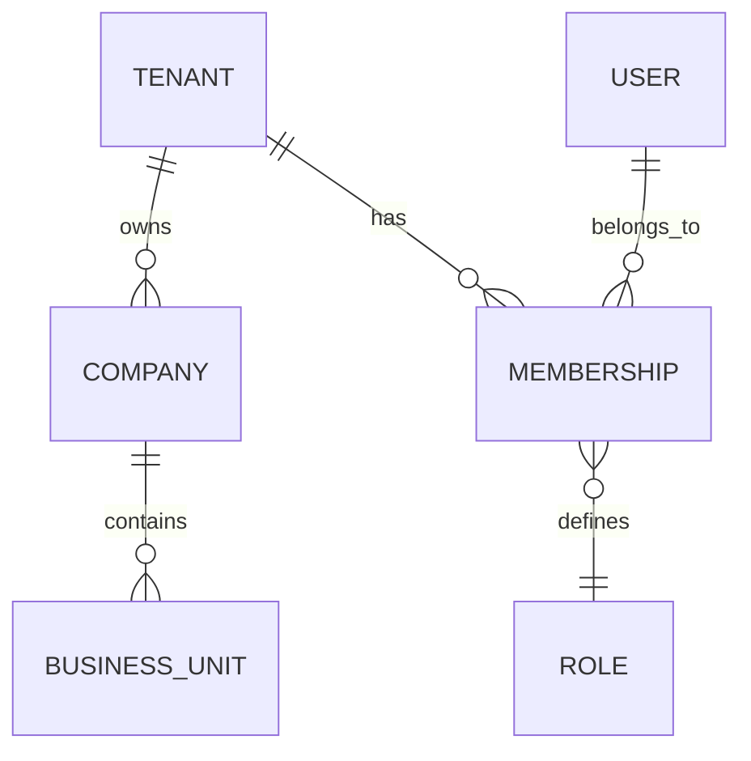
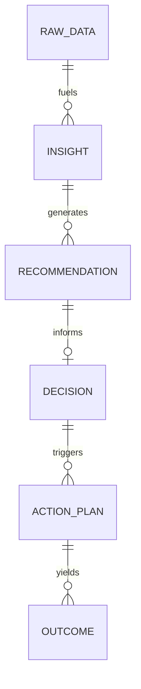
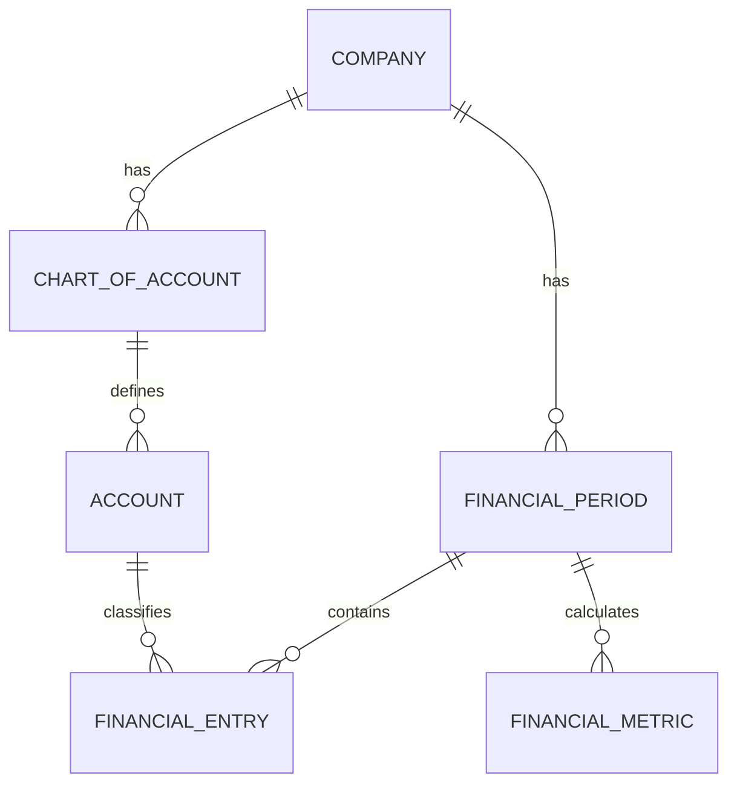

# ILLUMINE_CANONICAL_DATA_MODEL

## 1. Executive Summary
This document defines the canonical, technology-agnostic data model for the Illumine Executive Intelligence Platform. It serves as the architectural bridge transitioning from the current Firebase/Firestore (NoSQL) implementation to a target enterprise-grade, relational, multi-tenant architecture (PostgreSQL/Supabase). The model presented here focuses strictly on business domains, relationships, and data governance, independent of the underlying storage technology, though optimized for a relational schema.

## 2. Design Principles
- **Domain-Driven:** The model reflects business realities (Finance, Governance, Intelligence) rather than database limitations.
- **Multi-Tenant by Design:** Absolute data isolation at the structural level.
- **Immutability & Traceability:** Financial and decision data must preserve historical states.
- **AI Provenance:** Intelligence outputs must trace back to the model, prompt, and context that generated them.
- **Analytical Readiness:** Structured to support complex aggregations without client-side processing.

## 3. Current vs Target State
| Entity Concept | Current Firestore Representation | Target Canonical Entity | Reason for Change | Migration Complexity |
|---|---|---|---|---|
| Company/Workspace | `clients` collection | `Tenant` & `Company` | Separating billing/workspace from actual legal entities. | Medium |
| User Access | `client_users`, `ownerId` | `User`, `Membership`, `Role` | Standardizing RBAC and M:N relationships. | Medium |
| Financial Data | `financial_entries` (Flat NoSQL) | `FinancialPeriod`, `Account`, `FinancialEntry`, `Statement` | Ensuring relational integrity and eliminating N+1 reads. | High |
| Intelligence | `diagnostico` (Overwritten) | `Insight`, `Recommendation`, `Decision` | Preserving historical intelligence and separating AI output from executive action. | High |

## 4. Domain Boundaries
The platform consists of the following canonical domains:
1. **Identity & Access:** Users, Memberships, Roles, Permissions.
2. **Tenant & Organization:** Tenants (Billing/Workspace), Companies (Legal Entities), Business Units.
3. **Financial Intelligence:** Account Plans, Transactions, Statements, Ratios, Metrics.
4. **Governance & Risk:** Assessments, Risks, Controls, Findings.
5. **Decision Intelligence:** Problems, Alternatives, Insights, Recommendations, Decisions, Actions.
6. **Enterprise Context:** Knowledge items, evidence, context vectors.
7. **Commercial/Revenue:** Subscriptions, Plans, Advisor Partners.

## 5. Canonical Entities
- **Tenant:** The root administrative and billing boundary.
- **Company:** The actual business entity being analyzed (owned by Tenant).
- **User:** A human or system actor.
- **Membership:** The linkage defining a User's Role within a Tenant.
- **FinancialPeriod:** A locked accounting timeframe (e.g., FY2024, Aug 2024).
- **ChartOfAccount / Account:** The structured financial tree.
- **FinancialEntry:** A transactional or imported financial value.
- **Insight / Recommendation:** AI-generated or human-generated analytical outputs.
- **Decision:** A formalized executive choice based on intelligence.
- **Action:** A concrete step resulting from a Decision.

## 6. Entity Classification
- **MASTER DATA:** `Tenant`, `Company`, `User`, `ChartOfAccount`. (Core entities that change infrequently).
- **TRANSACTIONAL DATA:** `FinancialEntry`, `Action`. (High volume, event-driven).
- **ANALYTICAL / DERIVED DATA:** `FinancialMetric`, `FinancialScore`. (Calculated from transactional data).
- **INTELLIGENCE DATA:** `Insight`, `Recommendation`, `Diagnostic`. (AI or Advisor generated).
- **AUDIT DATA:** `AuditEvent`, `SystemLog`. (Immutable trails).

## 7. Tenant Model
- **What is a Tenant?** A workspace or subscription boundary (e.g., a Consulting Firm, or a holding company).
- **What is a Company?** A legal entity or distinct business operation.
- **Relationships:**
  - One Tenant has 1 to N Companies.
  - One Company belongs to exactly 1 Tenant.
  - A User belongs to N Tenants (via Memberships).
  - A User has a distinct Role in each Tenant.
- **Data Ownership:** All business data (Financials, Decisions) is owned by the `Company`. The `Company` is owned by the `Tenant`.
- **Tenant Boundary:** RLS must filter everything by `tenant_id`.

## 8. Identity & Access
**Relationship:** `User` (1) -> (N) `Membership` (N) <- (1) `Tenant`. `Membership` contains the `Role`.
**Role Assignment:** Roles MUST be **TENANT-SCOPED**. A user can be an Admin in Tenant A and an Advisor in Tenant B.
**SUPER_ADMIN:** Should be deprecated as a global bypass. Global administration should be restricted to a separate operational domain (e.g., an internal backoffice tenant) rather than an implicit bypass in the core application.

## 9. Company Model
`Tenant` (Root Workspace) -> `Organization` (Holding/Group, optional) -> `Company` (Legal Entity) -> `BusinessUnit` (Optional branches/cost centers).
Currently, Firestore merges Tenant and Company into `clients`. These MUST be separated to support Advisors who manage multiple companies under one consulting Tenant.

## 10. Financial Domain
**Canonical Flow:**
1. **Source Data:** Imported raw trial balances or DREs (`ImportEvent`, `RawFinancialData`).
2. **Normalized Data:** `FinancialEntry` mapped to the canonical `Account` within a `FinancialPeriod`.
3. **Calculated Metrics:** `FinancialStatementLine` (aggregated), `FinancialMetric` (calculated).
4. **Intelligence:** `FinancialScore`, `Insight`.

The model must explicitly store `FinancialPeriod` (e.g., 2024-12) to lock historical data. 

## 11. Financial Data Integrity
- **Immutability:** Once a `FinancialPeriod` is marked "Closed", all related `FinancialEntry` records become mathematically immutable.
- **Audit Trail:** Any adjustment post-close requires an explicit `AdjustmentEntry` linked to an `AuditEvent`.
- **Versioning:** Financial formulas (e.g., for EBITDA) must be versioned so historical metrics do not unexpectedly shift when formulas change.

## 12. Governance Domain
Separation of Concerns:
- **Assessment:** A periodic evaluation (e.g., Annual Board Review).
- **Finding:** A specific gap or positive element identified.
- **Risk:** A persistent threat tracked over time.
- **Decision:** Executive response to the Risk.
- **Action Plan:** Tasks generated to implement the Decision.

## 13. Intelligence Domain
**The Golden Thread of Intelligence:**
`DATA` -> `ANALYSIS` -> `INSIGHT` -> `RECOMMENDATION` -> `DECISION` -> `ACTION` -> `OUTCOME`

AI does not make decisions; it generates Insights and Recommendations. Humans make Decisions. This canonical model strictly separates the AI-generated `Recommendation` from the human `Decision`.

## 14. Knowledge & Context
To support the Executive Concierge / RAG:
- **KnowledgeItem:** A canonical piece of business truth (e.g., a policy, a strategic goal).
- **Source/Evidence:** Where the knowledge came from (a PDF, a Meeting Minute).
- **Context:** Metadata grouping knowledge (e.g., "Fiscal Strategy 2025").

## 15. Decision Intelligence
A `Decision` record must capture:
- **Problem/Context:** Why is this decision needed?
- **Alternatives:** What options were evaluated?
- **Selected Path:** What was chosen?
- **Responsible:** Who owns the outcome?
- **Outcome Tracking:** Expected vs. Actual results.
History is strictly IMMUTABLE. Decisions cannot be "deleted", only "superseded" or "archived".

## 16. Audit & Traceability
Every transactional and master data entity MUST include:
- `created_at`, `created_by`
- `updated_at`, `updated_by`
- `deleted_at`, `deleted_by` (Soft Delete)
Critical entities (Financials, Decisions) require an append-only `History/EventLog` table to track *what* changed and *why*.

## 17. Revenue / Commercial Domain
- **Subscription:** Links a `Tenant` to a `Plan`.
- **Advisor Partner:** A special `Tenant` type that can manage multiple downstream client `Tenants` or `Companies`.
*(Not for immediate implementation, but structurally reserved in the Tenant model).*

## 18. Relationship Model
- `Tenant` (1) : (N) `Company`
- `Company` (1) : (N) `FinancialPeriod`
- `Company` (1) : (1) `ChartOfAccount`
- `ChartOfAccount` (1) : (N) `Account`
- `FinancialPeriod` (1) : (N) `FinancialEntry`
- `Insight` (1) : (N) `Recommendation`
- `Recommendation` (1) : (1) `Decision` (Optional)

## 19. Entity Lifecycle
- **Master Data:** Soft delete only (`deleted_at`).
- **Financial/Audit Data:** NO DELETE. Only compensating transactions or archival.
- **Intelligence Data:** Archival / Superseding. An AI insight from 2024 is historically relevant in 2026.

## 20. Historical Data
Current architecture overwrites metrics. The canonical model requires temporal history.
`FinancialMetric` must include `period_id` and `calculation_timestamp` to preserve the exact metric as it was presented to the executive on a specific date.

## 21. Data Provenance
Every piece of data must trace its origin:
`SourceType`: `USER` | `IMPORT` | `API` | `CALCULATION` | `AI` | `SYSTEM`
If `AI`, a link to the `AIGenerationEvent` must exist.

## 22. AI Data Governance
An `AIGenerationEvent` entity must capture:
- `provider` (e.g., Google, OpenAI)
- `model` (e.g., gemini-2.0-flash)
- `prompt_template_version`
- `context_hash` (What data was injected?)
- `timestamp`
This guarantees reproducibility and defends against AI hallucinations in audits.

## 23. Conceptual Diagrams

### 23.1 Platform Context & Tenant Model


### 23.2 Intelligence & Decision Lifecycle


### 23.3 Financial Domain


## 24. Firestore Mapping
| CURRENT FIRESTORE | CANONICAL ENTITY | TRANSFORMATION | COMPLEXITY |
|---|---|---|---|
| `clients` | `Tenant` & `Company` | SPLIT | High |
| `client_users` | `Membership` | MERGE with Auth | Medium |
| `financial_entries` | `FinancialEntry` | MAP to FKs (`Period`, `Account`) | Very High |
| `account_plans` | `Account` | DIRECT | Low |
| `diagnostico` | `Insight` / `Decision` | SPLIT (Separate AI vs Human) | High |
| `payables`/`receivables` | `Payable` / `Receivable` | DIRECT | Low |

## 25. PostgreSQL Requirements
- **Foreign Keys:** Absolute requirement for `tenant_id`, `company_id`, `account_id`, `period_id`.
- **RLS (Row Level Security):** Mandated on all tables filtering by `tenant_id` or `company_id`.
- **Unique Constraints:** `(company_id, period_id)` for financial periods.
- **Audit Triggers:** Database-level triggers to populate `_history` tables for Financials and Decisions.

## 26. RLS Requirements
- **Read:** User must have an active `Membership` in the `Tenant` containing the `Company`.
- **Write:** Restricted by specific `Role` permissions (e.g., `ADVISOR`, `EXECUTIVE`).
- **Global:** `SUPER_ADMIN` should NOT exist at the RLS level; operations requiring multi-tenant access must explicitly grant memberships or use secure backend service roles, not client-side bypasses.

## 27. Design Principles (Recap)
- **Tenant Isolation:** Guaranteed by RLS, not application logic.
- **Least Privilege:** Memberships grant specific tenant-level access.
- **Relational Integrity:** No orphaned data.
- **AI Readiness:** Provenance built-in.

## 28. Anti-Patterns to Avoid
- **Simulated Foreign Keys:** Storing a string ID without a DB constraint.
- **Client-Side Cascades:** Expecting the React frontend to loop and delete related records.
- **Overwriting Intelligence:** Erasing last month's diagnostic with this month's diagnostic.
- **Uncontrolled SUPER_ADMIN:** Global `allow read, write: if true` bypasses.
- **Logic in Adapters:** Business logic (like legacy account migrations) existing inside persistence layers.

## 29. Architectural Decisions
1. **Decision:** Separation of Tenant and Company.
   - **Recommended:** Splitting the current `clients` concept into `Tenant` (Billing/Access) and `Company` (Business Data).
   - **Impact:** Allows Advisors to manage multiple companies efficiently and paves the way for Partner networks.
2. **Decision:** Intelligence Persistence.
   - **Recommended:** Store AI generation metadata alongside Insights.
   - **Impact:** Increases storage but guarantees executive auditability.
3. **Decision:** Financial History.
   - **Recommended:** Introduce `FinancialPeriod` to lock closed months.
   - **Impact:** Prevents retrospective data corruption.

## 30. Target Architecture
```
[ PRESENTATION (React/Vite) ]
          ↓
[ APPLICATION SERVICES (Zustand/Hooks) ]
          ↓
[ DOMAIN LOGIC (Intelligence/Finance) ]
          ↓
[ REPOSITORIES (Data Access Layer) ]
          ↓
[ SUPABASE / POSTGRESQL (RLS + ACID) ]
```
- Real-time updates handled by Supabase Realtime where strictly necessary.
- Intelligence generation brokered by secure backend services (Edge Functions/Cloud Functions) to protect API keys and ensure provenance.

## 31. Migration Considerations
- **No Big Bang:** Dual-write adapters must be implemented during Phase 4/5. 
- **Data Cleansing:** The massive volume of ad-hoc fix scripts in the root directory implies existing data anomalies in Firestore that must be cleansed *before* migrating to strict SQL.

## 32. Open Questions
- **OPEN QUESTION 1:** How should existing Firestore `diagnostico` data be mapped if it lacks AI provenance metadata?
- **OPEN QUESTION 2:** Should `financial_entries` imported natively via AI be treated identically to manual entries in audits?
- **OPEN QUESTION 3:** Are there existing clients operating as "Holding Companies" that already break the single `client` model?
- **OPEN QUESTION 4:** What is the precise definition of a "Closed" financial period in the current business workflow?
- **OPEN QUESTION 5:** Will Supabase be self-hosted or managed Cloud? (Impacts Edge function design).

## 33. Recommended Next Steps
1. Executive review and approval of this Canonical Data Model (Phase 3).
2. Explicit alignment on Tenant vs. Company structures.
3. Transition to Phase 4: PostgreSQL / Supabase Schema Design (Translating this document into actual SQL schemas).
