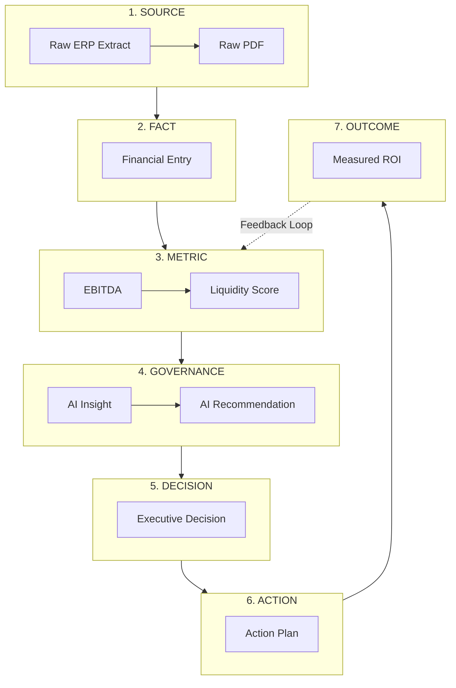
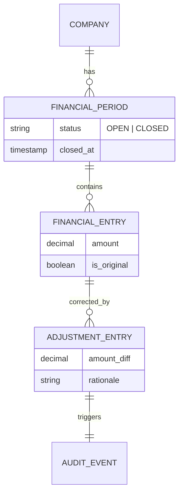
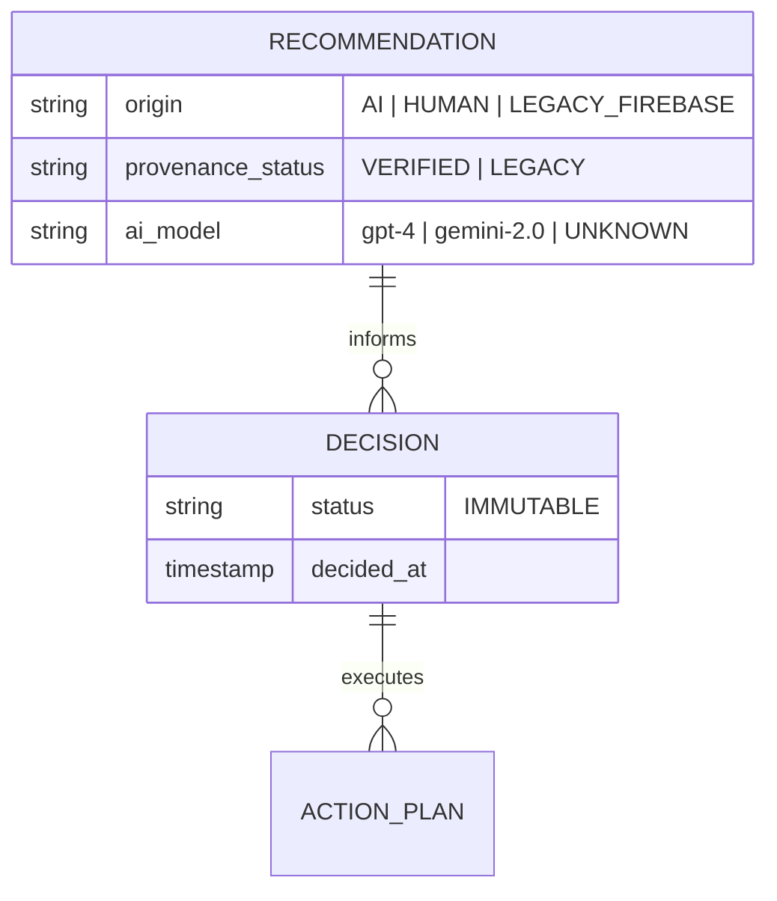

# ILLUMINE_PHASE_3_5_FINANCIAL_DATA_MODEL

## 1. Executive Summary
This document represents **Phase 3.5** of the Illumine architecture design. It focuses exclusively on the **Canonical Financial Data Model** and its structural integration with the **Executive Governance Model**. 

Illumine is not merely an accounting ERP; it is an Executive Governance Platform. As such, the database architecture must rigidly separate raw financial data from normalized facts, calculated metrics, and ultimately, executive decisions. This document codifies the 7-Layer Architecture that transforms raw data into actionable governance and tracks its outcomes.

## 2. The 7-Layer Executive Governance Architecture
The core architectural principle of Illumine is the unidirectional flow of value from data to outcome. The database must reflect these exact boundaries to guarantee provenance, auditability, and trust.

| Layer | Concept | Description | Architectural Requirement |
|---|---|---|---|
| **1. SOURCE** | *O que aconteceu* | Raw data from accounting systems, PDFs, APIs, or manual imports. | Must preserve the original, untampered payload/document. |
| **2. FACT** | *O dado normalizado* | Financial entries mapped to the canonical Illumine Chart of Accounts. | Must be immutable once the financial period is closed. |
| **3. METRIC** | *O que calculamos* | Aggregations, scores, and ratios (e.g., EBITDA, Liquidity). | Must be versioned based on the formula used at the time. |
| **4. GOVERNANCE**| *O que interpretamos*| AI-generated insights and recommendations. | Must retain strict AI provenance (model, context, prompt). |
| **5. DECISION** | *O que foi decidido* | The formal executive choice based on governance. | Strictly immutable. Historical record of leadership intent. |
| **6. ACTION** | *O que foi executado* | Tasks, assignments, and action plans. | Mutable status, but state changes must be audited. |
| **7. OUTCOME** | *O que resultou* | The measurable impact of the action over time. | Links back to future metrics to close the loop. |

## 3. Financial Data Entities (Layers 1 to 3)

### 3.1. Layer 1: SOURCE
- **`DataSource`**: Represents the origin system (e.g., Conta Azul, manual upload, AI PDF Parser).
- **`RawFinancialImport`**: Stores the raw payload, PDF reference, or original JSON. Includes an `import_hash` to guarantee it hasn't been tampered with.

### 3.2. Layer 2: FACT
- **`FinancialPeriod`**: A specific accounting timeframe (e.g., Jan/2026) for a specific `Company`.
  - **Status:** `OPEN` or `CLOSED`.
  - **Rule:** Once `CLOSED`, the period's integrity is mathematically preserved.
- **`ChartOfAccount` & `Account`**: The standardized tree structure.
- **`FinancialEntry`**: The normalized debit/credit or value mapped to an `Account` within a `FinancialPeriod`.
- **`AdjustmentEntry`**: If a `CLOSED` period requires correction, the original `FinancialEntry` is NOT edited. An `AdjustmentEntry` is created, linking back to the original, providing full traceability of *what was believed then* versus *what was corrected later*.

### 3.3. Layer 3: METRIC
- **`FinancialMetric`**: Calculated values (e.g., Working Capital, EBITDA margin).
  - Stores the exact value on a specific timestamp.
  - Linked to a `MetricDefinition` (the formula version) so historical reports never magically change if a formula is updated years later.
- **`FinancialScore`**: The normalized Illumine score (0-100) for a specific dimension.

## 4. Governance & Decision Entities (Layers 4 to 7)

### 4.1. Layer 4: GOVERNANCE
- **`Insight`**: An observation derived from Metrics (e.g., "Liquidity dropped 15% this quarter").
- **`Recommendation`**: A proposed course of action (e.g., "Renegotiate short-term debt").
- **Provenance Rules:** 
  - **Standard:** Must include `provider`, `model`, `prompt_hash`, `context_hash`.
  - **Legacy Firebase:** Must be migrated with `origin = LEGACY_FIREBASE`, `provenance_status = LEGACY`, `model = UNKNOWN`, `context_hash = NULL`. No retrospective fabrication of metadata.

### 4.2. Layer 5: DECISION
- **`Decision`**: The executive resolution.
  - Links to: The `Recommendation` it was based on, the `Company`, the `User` (Executive).
  - Contains: `problem_statement`, `selected_alternative`, `rationale`.
  - **Rule:** Strictly IMMUTABLE. If a decision is changed, a new `Decision` record supersedes the old one.

### 4.3. Layer 6: ACTION
- **`ActionPlan` & `ActionItem`**: The operational breakdown of a `Decision`.
  - Assigned to a `User`.
  - Has deadlines, statuses (`PENDING`, `IN_PROGRESS`, `COMPLETED`, `CANCELLED`).

### 4.4. Layer 7: OUTCOME
- **`OutcomeReview`**: A periodic assessment comparing the `Decision`'s expected result with future `FinancialMetric`s to measure the ROI of executive choices.

## 5. Lifecycle & Retention Policies
Soft Delete is NOT a universal rule. Entities follow specific lifecycle policies based on their nature:

| Entity Type | Policy | Examples |
|---|---|---|
| **Structural / Master** | **Soft Delete** | `Company`, `User`, `Membership`, `Account` |
| **Operational** | **Archive / Inactive** | `ActionPlan`, `ActionItem`, `Subscription` |
| **Audit / History** | **Immutable (No Delete)** | `FinancialEntry` (Closed), `FinancialPeriod`, `Decision`, `AuditEvent`, `Governance Provenance` |
| **PII / Compliance** | **Hard Delete** | Specific personal data requiring GDPR/LGPD compliance upon request (controlled via backend jobs). |

## 6. Security & Support Model (Platform Operations)

The global `SUPER_ADMIN` concept (allow read/write everything silently) is **DEPRECATED**. It is replaced by a formal Enterprise Support Model:

1. **Application User:** Normal users operating within `Tenant` / `Company` boundaries enforced by RLS.
2. **Platform Operator (Service Role):** Illumine internal support staff. They do not have implicit access to client data in the app.
3. **Explicit Impersonation:**
   - If support is needed, a Platform Operator initiates an `ImpersonationSession`.
   - This explicitly targets a specific `Tenant` / `Company`.
   - **Auditing:** Every read/write during this session logs to `SystemAuditLog` with `actor = Operator` and `impersonated = User/Tenant`.
   - Answers: *Who accessed? Why? When? What was viewed/changed?*

## 7. Conceptual Diagrams

### 7.1. The 7-Layer Pipeline Flow

### 7.2. Financial Period & Integrity Model

### 7.3. Governance Provenance & Legacy Handling

## 8. Summary of Revisions Validated in Phase 3.5
1. **Tenant x Company:** Strictly separated to support future Advisor Partner topologies where one Tenant holds multiple Companies.
2. **Financial Closing:** Adopted "historical preservation via adjustments" rather than rigid "locking".
3. **Legacy AI:** Explicitly modeled to retain existing Firestore diagnostics without forging metadata.
4. **Super Admin:** Replaced by audited "Explicit Impersonation".
5. **Retention Policies:** Segmented into Soft Delete, Archive, Immutable, and Hard Delete, depending on the entity class.
6. **7-Layer Pipeline:** Formally codified the Illumine Governance Architecture from Source to Outcome. 
