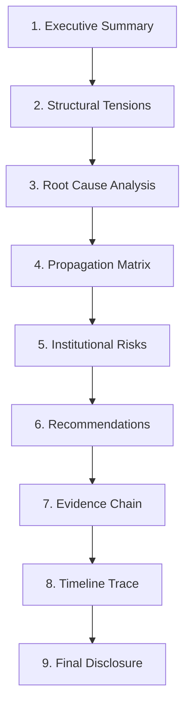

# Guia de Ensaio de Demonstração Executiva (Executive Demo Rehearsal Guide) 🏛️

Este guia define a conduta institucional, fiduciária e técnica para a preparação e execução de demonstrações da plataforma Illumine para Conselhos de Administração, Holdings, CFOs, Advisors e Family Offices.

---

## 1. Executive Demonstration Doctrine

A Illumine não é uma ferramenta de dashboards comerciais ou simulações estatísticas dinâmicas no frontend. Toda demonstração representa o funcionamento de um **Runtime Core fiduciário de inteligência**, no qual dados históricos de auditoria fiscal e financeira são processados de forma determinística para revelar a verdade causal dos fatos.

### Princípios da Demonstração:
1. **Runtime First**: Toda narrativa e visualização origina-se de snapshots do Runtime homologados. É estritamente proibido criar dados sob demanda ou improvisar diagnósticos.
2. **Disclosure Mandatory**: Antes de visualizar qualquer cenário corporativo, a interface do apresentador deve expor e ter o aceite dos termos de disclosure (`disclosureState === 'ACKNOWLEDGED'`).
3. **Causality First**: A apresentação deve guiar o conselho através da lógica causal real (de tensões para causas raiz) e nunca expor sugestões ou números sem evidências.
4. **Lineage-backed Storytelling**: Toda agregação ou transição de balanço deve expor a origem física dos dados (lineage de transações, notas ou registros públicos).
5. **Confidence-aware Narrative**: O apresentador é obrigado a expor abertamente a confiabilidade dos dados (`HIGH`, `MEDIUM`, `LOW`, `UNVERIFIED`). Degradações de confiança devem ser comunicadas de forma transparente.
6. **Fail-Closed Presentation**: Em caso de falha de lineage, ausência de evidências ou tentativa de bypass de segurança, a plataforma entra em estado de bloqueio. O apresentador deve respeitar o fail-closed e declarar a restrição fiduciária.
7. **Dummy Renderer Doctrine**: A interface apenas reflete os dados auditados. Não há estimativa de lucros ou recálculos no client-side.
8. **Institutional Evidence Visibility**: O explorador de evidências deve ser acessado para comprovar a proveniência e a idoneidade das informações.

> [!IMPORTANT]
> **A Illumine não demonstra dashboards. A Illumine demonstra processo decisório institucional explicável.**

---

## 2. Objetivos da Demonstração

* **Demonstrar causalidade institucional**: Conectar anomalias de capital diretamente às suas causas e origens estruturais.
* **Demonstrar explicabilidade**: Garantir que cada recomendação estratégica seja sustentada por uma cadeia inequívoca de evidências auditáveis.
* **Demonstrar propagação sistêmica**: Expor como estresses operacionais e alavancagens de curto prazo impactam a estabilidade consolidada de holdings.
* **Demonstrar lineage**: Apresentar o rastro de auditoria desde os indicadores de alto nível até a transação física de origem.
* **Demonstrar disclosure fiduciário**: Garantir conformidade ética e conformidade legal perante diretores e administradores.

---

## 3. Personas Executivas: Scripts & Roteiros de Condução

### A. CFO (Chief Financial Officer)
* **Foco Narrativo**: Estabilidade de capital, fidedignidade da DFC preditiva e reconciliação com livros diários.
* **Pontos Críticos**: Alavancagem oculta, indexação de taxas e esgotamento do runway.
* **Tensões Prioritárias**: Solvência e fluxo de caixa de tesouraria.
* **Evidências Relevantes**: Projeção de Runway e mapeamento causal de obrigações de curto prazo.
* **Profundidade de Drilldown**: Máxima (Exploração até o nível de lineage de proveniência de notas fiscais).

### B. Conselho Administrativo (Board of Directors)
* **Foco Narrativo**: Governança fiduciária, controle de riscos e validação do plano estratégico de Turnaround.
* **Pontos Críticos**: Violações ativas de covenants ou passivos omitidos.
* **Tensões Prioritárias**: Danos reputacionais, governança e conformidade legal.
* **Evidências Relevantes**: Relatórios de auditoria ativa assinados pelo Runtime.
* **Profundidade de Drilldown**: Alta (Navegação estruturada pelas tensões e recomendações com foco na causa raiz).

### C. Family Office / Investidores
* **Foco Narrativo**: Preservação de patrimônio, mitigação de contágio entre ativos do portfólio.
* **Pontos Críticos**: Risco de contágio sistêmico em holdings multientidade.
* **Tensões Prioritárias**: Alocação de capital e trade-offs operacionais estruturados.
* **Evidências Relevantes**: Matriz de propagação e análise de sensibilidade de parâmetros.
* **Profundidade de Drilldown**: Média-Alta (Foco na matriz de contágio de portfólio).

### D. Advisor / Turnaround Specialist
* **Foco Narrativo**: Resolução de crises operacionais, velocidade de identificação de gargalos.
* **Pontos Críticos**: Prazos médios de recebimento falsificados ou faturamento artificial.
* **Tensões Prioritárias**: Capital de giro degradado por desalinhamento comercial.
* **Evidências Relevantes**: Advisory delta panel e tracking de calibração paramétrica.
* **Profundidade de Drilldown**: Máxima (Drilldown causal de propagação e lineage de notas e faturas).

---

## 4. Cenários Homologados no Registro

O ensaio deve operar estritamente sobre os cenários do [ExecutiveDemoScenarioRegistry](file:///Users/marcelosouza/Documents/illumine-strategic-governance-advisor/src/core/runtime/executive/demo/ExecutiveDemoScenarioRegistry.ts):

| Cenário ID | Tensão Estrutural | Causalidade Principal | Nível de Confiança | Principais Violations |
| :--- | :--- | :--- | :--- | :--- |
| **`TURNAROUND`** | Alavancagem no curto prazo | Desalinhamento cíclico de fluxo de tesouraria | **HIGH** | `WARNING`: Alavancagem elevada na tesouraria |
| **`ACCELERATED_GROWTH`**| Necessidade de capital de giro | Consumo rápido de liquidez por expansão física | **MEDIUM** | Nenhuma (perfil de crescimento padrão) |
| **`SYSTEMIC_CONTAGION`**| Contágio em holding | Deterioração de controladas propagando para a matriz | **LOW** | `CRITICAL`: Propagação sistêmica na controladora |
| **`CASH_COLLAPSE`** | Esgotamento de runway | Queda severa e progressiva na entrada líquida de caixa | **LOW** | `CRITICAL`: Runway abaixo do limite de 30 dias |

---

## 5. Fluxo Oficial de Condução Causal

O apresentador deve navegar exclusivamente através do `GuidedBoardJourneyEngine`, seguindo a sequência lógica:

### Regras de Storytelling de Conselho:
* **NÃO pule a Causa Raiz**: O board não pode aprovar recomendações sem ver a comprovação física da causa.
* **Apresente Riscos Inteiramente**: Nunca mascare violações críticas ou diminua o tom das severidades (`CRITICAL`/`WARNING`).
* **Trate Confiabilidade com Rigor**: Se o cenário indicar confiança `LOW` ou `MEDIUM`, declare imediatamente o motivo no início da apresentação (ex: dados fiscais ausentes ou pendentes de auditoria).

---

## 6. fail-closed Demonstration Rules

Se durante o ensaio ou apresentação real ocorrer:
1. **Quebra de Linhagem (`lineageIntegrityHash` alterado ou nulo)**: A tela exibirá imediatamente erro governamental. O apresentador deve declarar que o dataset sob demonstração perdeu a assinatura fiduciária.
2. **Disclosure `PENDING` ou `BLOCKED`**: O botão de navegação ficará desativado. Não tente forçar a navegação via console ou bypass no React; faça o aceite fiduciário no painel correspondente para prosseguir.
3. **Violations Ocultas**: A interface detecta tentativas de esconder blocos de erro e bloqueia a navegação. Aceite que violações de covenants e estresses de caixa devem permanecer visíveis na tela.

---

## 7. Pré-Demo Rehearsal Checklist

Antes de iniciar a sessão com o cliente ou investidores, valide:
* [ ] O comando `npm run governance:audit` retorna **COMPLIANT**.
* [ ] O navegador está aberto em modo **Fullscreen** (`BoardPresentationMode`).
* [ ] O cenário selecionado é homologado pelo registry.
* [ ] O painel de termos de disclosure está visível e pronto para aceite.
* [ ] O apresentador memorizou as causas reais do runtime sem improvisações.
