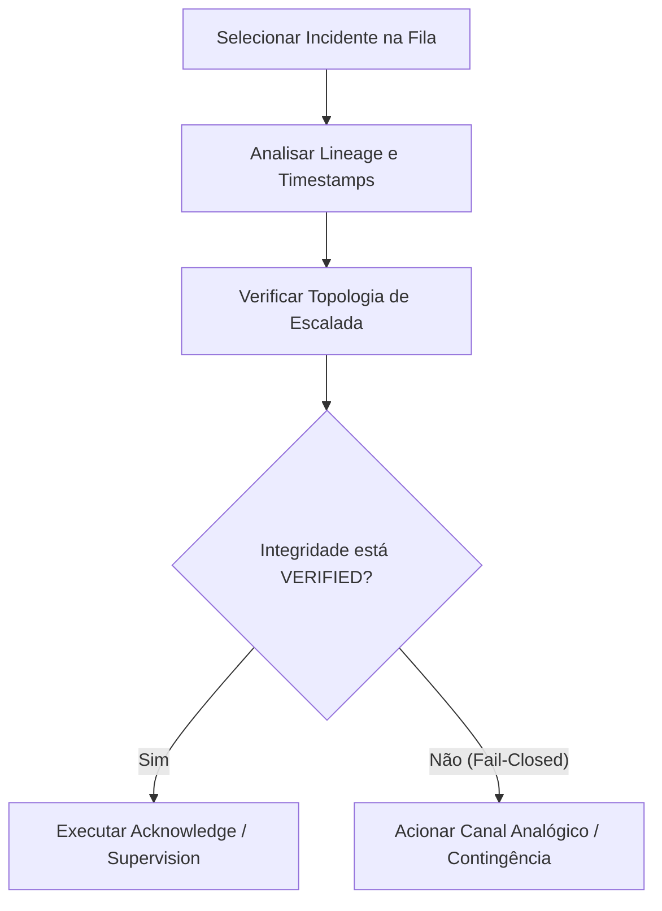

# Guia de Resposta a Incidentes Fiduciários (Conselho e Diretoria)

Este guia prático fornece o protocolo de contingência e resposta rápida para membros do Conselho de Administração, CEO e CFO durante a ocorrência de incidentes críticos no **Governance Command Center (GCC)**.

---

## 1. Matriz de Responsabilidades

| Tipo de Incidente | Nível de Severidade | Resposta Inicial (SLA) | Autoridade de Decisão |
| :--- | :--- | :--- | :--- |
| **LIQUIDITY_PRESSURE** | CRITICAL | 4 Horas | CFO |
| **FIDUCIARY_ESCALATION** | SYSTEMIC | 2 Horas | Conselho / Board |
| **CROSS_ENTITY_CONTAGION** | HIGH | 6 Horas | Comitê de Riscos |
| **GOVERNANCE_BREACH** | SYSTEMIC | Immediato | CEO & Board |

---

## 2. Protocolo de Triagem (Passo a Passo)

Ao identificar um incidente de alta severidade no Command Center, siga estas etapas na interface:

1. **Seleção e Foco**: Clique no incidente ativo no Grid Operacional para inspecionar os detalhes no painel lateral.
2. **Auditoria de Linhagem (Lineage)**: Visualize o `lineageHash` no console de linhagem para certificar que a informação é fiduciariamente rastreável ao banco de dados do inquilino.
3. **Escalada Societária**: Se o incidente demandar intervenção externa de acionistas ou conselheiros, utilize a ação **ESCALATE** para elevar o status e registrar o evento formalmente no livro de supervisão do inquilino.

---

## 3. Diretrizes de Contenção

Para mitigar o contágio intercompany ou a deterioração linear de liquidez:
- **Liquidez sob Pressão**: O CFO deve acionar o buffer de tesouraria de emergência ou cortar despesas operacionais não críticas em subsidiárias afetadas, registrando a ação como **CONTAINED** para suspender alertas de propagação sistêmica.
- **Quebra de Diretrizes**: O Conselho deve suspender temporariamente operações intercompany de concessão de garantias até que uma auditoria completa seja concluída.

---

## 4. Contingência sob Lockdown (FAIL_CLOSED)

Se a telemetria do sistema ou a auditoria estática falhar, o GCC entrará em `FAIL_CLOSED`.
- **Sintoma**: Um aviso vermelho brilhante indicará a indisponibilidade das ações digitais e os incidentes serão congelados.
- **Ação Executiva**: Nenhuma ação de supervisão ou encerramento digital será autorizada no painel. Todas as decisões fiduciárias e de liquidez deverão ser documentadas fisicamente ou através de canais analógicos oficiais de governança até que a integridade da assinatura e dos hashes de dados seja restaurada.
