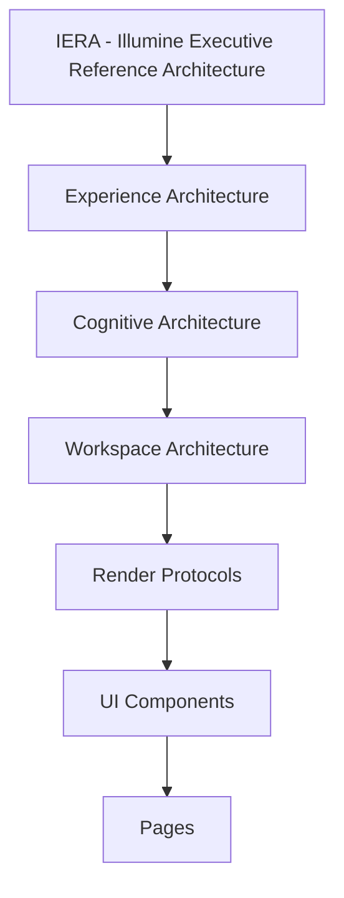

# EXPERIENCE_ARCHITECTURE.md — Experience Architecture Foundation (EAF v1.0)

> **Documento Normativo Canônico de Arquitetura de Experiência (Level A — Canonical)**  
> *Horizonte Temporal de Estabilidade: 10+ Anos (2026 – 2036+)*  
> *Documentos Complementares: [`ARCHITECTURE_CONSTITUTION.md`](file:///Users/marcelosouza/Documents/illumine-strategic-governance-advisor/ARCHITECTURE_CONSTITUTION.md) | [`ARCHITECTURE_REFERENCE.md`](file:///Users/marcelosouza/Documents/illumine-strategic-governance-advisor/ARCHITECTURE_REFERENCE.md)*  
> *Status: Homologado & Congelado*

---

## 1. Visão Geral e Propósito

A **Experience Architecture (EA v1.0)** formaliza a camada oficial que elenca o propósito cognitivo de cada interação na plataforma Illumine Strategic Governance Advisor, atuando como o **elo normativo entre a Arquitetura de Domínio e a Arquitetura Visual**.

Com a instituição da EA v1.0, o *Render Protocol* deixa de ser o centro isolado da experiência e passa a ser reconhecido como a implementação visual concreta de uma arquitetura cognitiva superior.

---

## 2. Nova Hierarquia da Illumine Executive Reference Architecture (IERA)

A hierarquia de abstração da IERA é reestruturada normativamente para:

$$\text{IERA} \longrightarrow \text{Experience Architecture} \longrightarrow \text{Cognitive Architecture} \longrightarrow \text{Workspace Architecture} \longrightarrow \text{Render Protocols} \longrightarrow \text{UI Components} \longrightarrow \text{Pages}$$



---

## 3. Os 5 Princípios Universais da Experience Architecture

1. **Princípio da Finalidade Cognitiva (*Cognitive Purpose First*)**: Toda experiência na plataforma possui obrigatoriamente um propósito cognitivo bem definido.
2. **Princípio da Resposta de Negócio (*Business Question First*)**: Toda experiência responde a uma pergunta de negócio primária e explícita antes de qualquer especificação de interface.
3. **Princípio da Derivação Causal (*Cognitive Pipeline Derivation*)**: Toda experiência deriva do Pipeline Cognitivo Canônico da IERA ($\text{Fact} \rightarrow \text{Evidence} \rightarrow \text{Inference} \rightarrow \text{Finding} \rightarrow \text{Alternative} \rightarrow \text{Recommendation} \rightarrow \text{Resolution} \rightarrow \text{Action} \rightarrow \text{Measurement} \rightarrow \text{Learning}$).
4. **Princípio da Interface Consequente (*Interface as Consequence*)**: Interfaces gráficas são a consequência determinística da experiência cognitiva, e nunca a sua origem ou motivador.
5. **Princípio do Protocolo Especializado (*Render Protocol Specialization*)**: Os *Render Protocols* são especializações visuais da *Experience Architecture*, operando sob suas regras cognitivas.

---

## 4. Cognitive Experience Architecture (As 8 Camadas Cognitivas Universais)

Toda experiência da plataforma deriva e processa sequencialmente as **8 Camadas Cognitivas Universais**. Estas camadas não representam elementos de layout ou componentes visuais, mas sim o modelo mental de processamento cognitivo da organização:

$$\text{Contexto} \longrightarrow \text{Intenção} \longrightarrow \text{Compreensão} \longrightarrow \text{Diagnóstico} \longrightarrow \text{Deliberação} \longrightarrow \text{Evidência} \longrightarrow \text{Execução} \longrightarrow \text{Aprendizado}$$

| Camada Cognitiva | Descrição do Processamento Cognitivo |
| :--- | :--- |
| **1. Contexto** | Estabelece as fronteiras institucionais, a entidade ativa, a moeda, o período contábil e as premissas macroeconômicas. |
| **2. Intenção** | Mapeia o objetivo estratégico primário do executivo (`ExecutiveIntent`) para o escopo da interação. |
| **3. Compreensão** | Sintetiza a situação corrente, agregando dados brutos em representações semânticas inteligíveis. |
| **4. Diagnóstico** | Identifica a Causa Dominante, restrições operacionais/financeiras, gargalos e anomalias de desempenho. |
| **5. Deliberação** | Confronta alternativas estratégicas, avaliando trade-offs, riscos e o deslocamento esperado de KPI (`ExpectedKPIShift`). |
| **6. Evidência** | Fundamenta toda recomendação com a trilha auditável de proveniência (`Decision Trace ID`) e dados fiduciários. |
| **7. Execução** | Converte deliberações em resoluções de conselho (`BoardResolution`) e planos de ação táticos (`ExecutiveAction`). |
| **8. Aprendizado** | Alimenta a memória organizacional (`OrganizationalMemory`) medindo o impacto real vs. previsto para calibração contínua. |

---

## 5. Experience Taxonomy (As 4 Categorias Canônicas de Experiência)

A plataforma classifica todas as interações e superfícies em **4 Categorias Canônicas de Experiência**:

### 5.1 Decision Experience
* **Objetivo**: Apoiar e fundamentar decisões estratégicas de alto impacto, governança e deliberações do Conselho.
* **Pergunta Primária de Negócio**: *Qual decisão devemos tomar?*
* **Escopos de Aplicação**: Liquidez, Demonstração do Resultado (DRE), Fluxo de Caixa, Capital de Giro, ESG & Governança (ESGIM), Estratégia Corporativa, Board Pack.

### 5.2 Registration Experience
* **Objetivo**: Administrar entidades institucionais, parametrizar estruturas contratuais/tributárias e garantir a integridade do cadastro.
* **Pergunta Primária de Negócio**: *A base operacional e cadastral está íntegra?*
* **Escopos de Aplicação**: Cadastro de Clientes (EFA), Parceiros & Fornecedores, Empresas/Tenants, Usuários, Permissões e Matriz RBAC.

### 5.3 Operational Experience
* **Objetivo**: Executar, monitorar e orquestrar processos táticos, planos de ação e fluxos de trabalho.
* **Pergunta Primária de Negócio**: *O que precisa ser executado e qual o status da operação?*
* **Escopos de Aplicação**: Workflows de Aprovação, Gestão de Projetos, Diretrizes Táticas, Pendências, Roadmaps de Execução.

### 5.4 Governance Experience
* **Objetivo**: Transformar conhecimento acumulado, histórico decisório e inteligência causal em aprendizado contínuo.
* **Pergunta Primária de Negócio**: *O que aprendemos com nossas decisões passadas e baselines de mercado?*
* **Escopos de Aplicação**: Memória Organizacional (`OrganizationalMemory`), Grafo de Conhecimento Causal, Linha do Tempo Decisória (`DecisionTimeline`), Aprendizado Executivo, Benchmarks Setoriais.

---

## 6. Workspace Architecture

Os **Workspaces** são as fronteiras físicas de contexto de trabalho que delimitam responsabilidades e evitam a mistura de padrões cognitivos:

```
Illumine Experience Architecture
├── Executive Workspace      (Foco: Decision Experience & Conselho)
├── Platform Workspace       (Foco: Registration Experience & Administração)
├── Operational Workspace    (Foco: Operational Experience & Execução)
└── Governance Workspace   (Foco: Governance Experience & Memória Causal)
```

| Workspace | Categoria Predominante | Perfil do Usuário Alvo | Isolamento Cognitivo |
| :--- | :--- | :--- | :--- |
| **Executive Workspace** | `Decision Experience` | Conselho, CEO, CFO, Diretoria | Zero ruído operacional; máxima densidade sintética. |
| **Platform Workspace** | `Registration Experience` | Administradores, Compliance, FP&A | Foco em integridade, cadastros e parametrização. |
| **Operational Workspace** | `Operational Experience` | Gerentes de Projeto, Operações, Controladoria | Foco em execução, tarefas e acompanhamento de planos. |
| **Governance Workspace** | `Governance Experience` | Análise Estratégica, R&D, Advisory | Foco em padrões causais, lições aprendidas e memórias. |

---

## 7. Especialização de Render Protocols

Cada categoria de *Experience* especializa a *Cognitive Architecture* e se conecta a um *Render Protocol* específico:

$$\begin{aligned}
\text{Experience Architecture} &\longrightarrow \text{Decision Experience} \longrightarrow \text{Executive Cognitive Architecture} \longrightarrow \text{Executive Render Protocol} \\
\text{Experience Architecture} &\longrightarrow \text{Registration Experience} \longrightarrow \text{Platform Cognitive Architecture} \longrightarrow \text{Platform Render Protocol} \\
\text{Experience Architecture} &\longrightarrow \text{Operational Experience} \longrightarrow \text{Operational Cognitive Architecture} \longrightarrow \text{Operational Render Protocol} \\
\text{Experience Architecture} &\longrightarrow \text{Governance Experience} \longrightarrow \text{Governance Cognitive Architecture} \longrightarrow \text{Governance Render Protocol}
\end{aligned}$$

---

## 8. Matriz Canônica de Classificação de Páginas

Toda página presente ou futura na plataforma DEVE pertencer a exatamente **uma** *Experience* e **um** *Workspace*:

| Página / Superfície | Experience Category | Target Workspace | Render Protocol Associado |
| :--- | :--- | :--- | :--- |
| **Gestão de Liquidez (`FinancialPositionPage`)** | `Decision` | `Executive` | `Executive Render Protocol` |
| **Demonstração do Resultado (`BalanceSheetPage`)** | `Decision` | `Executive` | `Executive Render Protocol` |
| **Fluxo de Caixa (`CashFlowPage`)** | `Decision` | `Executive` | `Executive Render Protocol` |
| **Capital de Giro (`PayablesPage` / `ReceivablesPage`)**| `Decision` | `Executive` | `Executive Render Protocol` |
| **Relatório Executivo / Board Pack (`RelatorioExecutivoPage`)**| `Decision` | `Executive` | `Executive Render Protocol` |
| **Governança & ESG (`EsgimPage`)** | `Decision` | `Executive` | `Executive Render Protocol` |
| **Simulador Estratégico (`StrategicSimulatorPage`)** | `Decision` | `Executive` | `Executive Render Protocol` |
| **Gestão de Clientes (`ClientsPage`)** | `Registration` | `Platform` | `Platform Render Protocol` |
| **Gestão de Parceiros (`PartnersPage`)** | `Registration` | `Platform` | `Platform Render Protocol` |
| **Gestão de Usuários & RBAC (`UsersPage`)** | `Registration` | `Platform` | `Platform Render Protocol` |
| **Parametrização Fiduciária (`ControladoriaPage`)** | `Registration` | `Platform` | `Platform Render Protocol` |
| **Planos de Ação & Diretrizes (`PlanoAcaoPage`)** | `Operational` | `Operational` | `Operational Render Protocol` |
| **Workflows & Pendências (`WorkflowsPage`)** | `Operational` | `Operational` | `Operational Render Protocol` |
| **Execução de Projetos (`ProjectsPage`)** | `Operational` | `Operational` | `Operational Render Protocol` |
| **Memória Organizacional (`OrganizationalMemoryPage`)**| `Governance` | `Governance` | `Governance Render Protocol` |
| **Grafo de Conhecimento Causal (`KnowledgeGraphPage`)**| `Governance` | `Governance` | `Governance Render Protocol` |
| **Decision Timeline (`DecisionTimelinePage`)** | `Governance` | `Governance` | `Governance Render Protocol` |
| **Benchmarks Setoriais (`BenchmarksPage`)** | `Governance` | `Governance` | `Governance Render Protocol` |

---

## 9. Governança e Congelamento Conceitual

1. **Invariância de Código na Wave EAF / AGC v1.0**: Esta fase formaliza estritamente os artefatos normativos, cartoriais e de governança. Nenhuma linha de código de produção, componente React ou contrato de runtime é alterado nesta wave.
2. **Diretriz para Waves Futuras**: Todas as implementações e refatorações subsequentes de UI/UX deverão obrigatoriamente se alinhar à taxonomia, aos cartórios e às especificações definidas na EAF/AGC v1.0.
3. **Mecanismo de Alteração**: Qualquer alteração na classificação de uma página ou criação de novas *Experiences* exige a emissão de uma RFC (*Request for Comments*) homologada por unanimidade pelo Architecture Council com publicação de ADR.

---

## 10. Future Evolution (Diretrizes de Evolução por Implementação)

Com o encerramento da **Architecture Governance Completion (AGC v1.0 / ADR-070)**, declara-se **congelada a fase de fundação conceitual da Illumine Executive Reference Architecture (IERA)**. 

A partir deste marco, a plataforma evoluirá **exclusivamente por implementação concreta**, sendo estritamente vedada a alteração da arquitetura cognitiva ou conceitual sem novo processo de governança formal.

### Escopo Permitido para Waves Futuras
As próximas Waves de desenvolvimento passarão a atuar exclusivamente em:
- Implementação de novos **Render Protocols** especializados (`Platform Render Protocol`, `Operational Render Protocol`, `Governance Render Protocol`).
- Construção de novas **superfícies e páginas** (devidamente classificadas na matriz).
- Criação de novos **componentes de interface visual** (UI Components).
- Desenvolvimento de novas **Capabilities** de negócio.
- Adição de novos **Workspaces** (exclusivamente mediante emissão de ADR).
- Integração de novos **Inference Providers** e conectores de dados.

> [!CAUTION]
> **É expressamente proibido alterar o Pipeline Cognitivo, a taxonomia de experiências congelada (`EXP-001` a `EXP-004`) ou o modelo de domínio sem submeter uma solicitação formal de alteração arquitetural aprovada pelo Architecture Council.**

