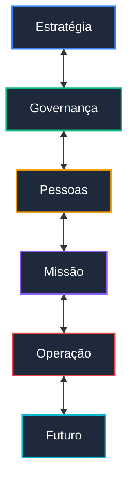

# Governance Cognitive Certification Executive White Paper v1.0

**Illumine Governance™ – System of Institutional Intelligence**
**Document ID:** GCC-WP-2026-V1  
**Release Date:** June 2026  
**Audience:** Boards of Directors, C-Level Executives, Investors, and Strategic Partners  

---

> [!NOTE]
> *Este white paper apresenta a fundamentação metodológica e arquitetural do Illumine Governance™ e documenta oficialmente a obtenção da primeira Certificação Cognitiva de Nível 5 (Cognitively Certified) da plataforma.*

---

## 1. Executive Summary

A governança corporativa moderna enfrenta um paradoxo analítico: as organizações possuem mais dados do que nunca, mas permanecem cegas para os riscos sistêmicos e comportamentais que precedem o colapso institucional. Em resposta a essa lacuna, o **Illumine Governance™** alcançou formalmente a **Certificação Cognitiva Nível 5 (Cognitively Certified)**.

Esta validação foi conduzida sob as regras estritas do *Governance Cognitive Assurance & Certification Framework v1.0*, atestando a aprovação da arquitetura em auditorias cognitivas estruturadas baseadas em conflitos corporativos e fiduciários complexos da vida real (CAE-001 a CAE-005).

A certificação comprova empiricamente que a plataforma é capaz de interpretar, arbitrar e recomendar decisões estratégicas em tempo real, integrando simultaneamente seis dimensões vitais:
1. **Geração de valor** (Eficácia operacional e comercial)
2. **Proteção de valor** (Integridade e segurança fiduciária)
3. **Continuidade institucional** (Resiliência operacional e governança de pessoas)
4. **Aderência aos princípios** (Conformidade ética e salvaguardas constitucionais)
5. **Alinhamento missional** (Coerência entre o propósito corporativo e a prática)
6. **Sustentabilidade futura** (Capacidade adaptativa e prontidão prospectiva)

---

## 2. The Problem

### O Limite dos Sistemas Tradicionais de Informação

As corporações atuais investem milhões em pilhas tecnológicas que coletam, organizam e exibem dados:
* **ERPs (Enterprise Resource Planning):** Registram com precisão as transações passadas e os fluxos de caixa operados.
* **CRMs (Customer Relationship Management):** Mapeiam o histórico e a intensidade das interações comerciais com clientes.
* **BI (Business Intelligence) & Dashboards:** Consolidam e apresentam indicadores de desempenho (KPIs) de forma visual.

Apesar da sofisticação dessas ferramentas, elas compartilham de uma limitação fundamental: **são sistemas de registro, não de discernimento.** Elas medem o que aconteceu ou o que está acontecendo sob premissas estáticas, mas falham em responder à pergunta crítica:

> [!WARNING]
> *“Esta organização continuará saudável e viável quando as condições de mercado deixarem de ser favoráveis?”*

Dashboards tradicionais frequentemente geram uma falsa sensação de segurança. Indicadores contábeis positivos (como crescimento acelerado de receita e EBITDA robusto) podem coexistir com queimas de caixa fatais, fraudes constitucionais ocultas ou dependências de pessoas-chave capazes de implodir a operação no dia seguinte. Os sistemas tradicionais não conseguem enxergar o espaço vazio entre os números.

---

## 3. The Governance Thesis

### Governança Institucional Inteligente

A tese central do Illumine Governance™ estabelece que **organizações raramente fracassam por problemas estritamente financeiros.** As quebras fiduciárias e as crises de imagem são, em sua grande maioria, o efeito final e visível de uma falha de interpretação prévia ocorrendo de forma invisível.

O colapso corporativo ocorre quando a liderança perde a capacidade de correlacionar e interpretar os sinais fracos que surgem na interseção das diferentes forças da organização:



Uma Governança Institucional Inteligente exige uma infraestrutura capaz de atuar como um "segundo cérebro" da organização — uma camada cognitiva de supervisão contínua que compreende as interações dinâmicas entre essas dimensões e orienta a alta administração com base em princípios, e não apenas em números agregados.

---

## 4. ESGIM™ Framework

Para estruturar e organizar a leitura da integridade corporativa, o Illumine Governance™ introduz a metodologia **ESGIM™**, que expande as fronteiras do ESG tradicional para contemplar a identidade institucional profunda:

* **Environmental (Ambiental):** Avaliação do impacto ecológico das operações, da eficiência energética, da gestão de resíduos e da aderência às diretrizes de sustentabilidade física globais.
* **Social (Social):** Monitoramento das relações da organização com suas comunidades, força de trabalho e fornecedores, assegurando o respeito aos direitos e a geração de valor compartilhado.
* **Governance (Governança):** Análise da estrutura de tomada de decisão, transparência contábil, independência dos órgãos de controle e proteção ao investidor.
* **Institutional (Institucional):** Avaliação do "chassi" da empresa: a solidez dos processos, a governança de pessoas, planos de sucessão executiva e a institucionalização do conhecimento tácito.
* **Mission (Missão):** Verificação do alinhamento existencial do negócio, garantindo que a geração de lucro não corrompa ou desvie a organização de seu propósito fundador de longo prazo.

---

## 5. The Seven Intelligences

A orquestração do framework ESGIM™ e a interpretação de cenários complexos são executadas pelas **Sete Inteligências Estruturantes** do Illumine:

1. **Economic Intelligence:** Responde à pergunta *"Existe geração de valor?"*, analisando margens, EBITDA, lucros contábeis e potencial de escala.
2. **Fiduciary Intelligence:** Responde à pergunta *"O valor está protegido?"*, focando na integridade do fluxo de caixa, liquidez corrente, solvência e endividamento.
3. **Institutional Intelligence:** Responde à pergunta *"Existe continuidade institucional?"*, avaliando a robustez dos processos, dependências operacionais e maturidade administrativa.
4. **Causal Intelligence:** Responde à pergunta *"Por que os fenômenos observados estão ocorrendo?"*, mapeando a raiz dos conflitos e rastreando efeitos de segunda e terceira ordem das decisões corporativas.
5. **Constitutional Intelligence:** Responde à pergunta *"Existe aderência aos princípios?"*, monitorando desvios éticos, fraudes contratuais e conformidade com a Constituição Cognitiva.
6. **Missional Intelligence:** Responde à pergunta *"A organização está vivendo sua razão de existir?"*, medindo o alinhamento estratégico com o propósito central declarado.
7. **Prospective Intelligence:** Responde à pergunta *"A organização está preparada para o futuro?"*, interpretando a capacidade adaptativa, P&D, transições regulatórias e ameaças disruptivas de longo prazo.

---

## 6. The Cognitive Constitution

Para garantir que a inteligência artificial não alucine e mantenha absoluta consistência fiduciária e ética, a plataforma opera sob uma **Constituição Cognitiva** rígida. Esta constituição define a precedência e a arbitragem entre as inteligências por meio de regras fundamentais:

### Constitutional Override
> [!IMPORTANT]
> **"Resultados não podem substituir princípios."**  
> Se a *Constitutional Intelligence* identificar uma violação crítica de integridade ou ética (`CRITICAL CONSTITUTIONAL BREACH`), o sistema executa um override imediato. Diagnósticos de excelência financeira ou fiduciária são vetados e o rating corporativo é rebaixado para `ESGIM_CRITICAL`.

### Fiduciary Override
> [!IMPORTANT]
> **"Crescimento não pode destruir valor."**  
> A *Economic Intelligence* não possui permissão para gerar diagnósticos otimistas se a *Fiduciary Intelligence* reportar fragilidade estrutural severa de liquidez ou fluxo de caixa. O crescimento comercial desordenado que consome o capital de giro ativa a trava fiduciária de ratings.

### Mission Sustainability Principle
> [!IMPORTANT]
> **"Missão legítima exige sustentabilidade."**  
> O impacto social ou missional não anula a necessidade de solidez financeira. O sistema impede falsos positivos que romanceiam o terceiro setor ou negócios sociais, forçando o diagnóstico de risco operacional caso o runway financeiro seja curto.

### Institutional Continuity Principle
> [!IMPORTANT]
> **"Continuidade precisa ser construída."**  
> Resultados financeiros não substituem chassi operacional. O sistema penaliza e limita o rating corporativo caso haja dependência excessiva de sócios-fundadores ou falta de planos formais de sucessão executiva e estruturação de processos.

### Future Sustainability Principle
> [!IMPORTANT]
> **"Resultados presentes não garantem o amanhã."**  
> A estabilidade atual é confrontada com a capacidade de inovação e investimento de longo prazo. Se a taxa de inovação e diversificação da empresa for inferior à velocidade regulatória e mercadológica externa, o rating prospectivo é vetado como `FRAGILE`.

---

## 7. The Cognitive Certification Program

Para certificar que estes princípios constitucionais operam sem falhas, o Illumine Governance™ estabeleceu seu programa oficial de Assurance Cognitiva, composto por quatro camadas independentes:

```
[ Assurance Framework (Autoridade Máxima) ]
                   │
                   ▼
[ Validation Framework (Stress Test Design) ]
                   │
                   ▼
[ Audit Program (Execução e Geração de Evidências) ]
                   │
                   ▼
[ Certification Report (Emissão da Decisão Oficial) ]
```

---

## 8. Certified Audit Results

A certificação cognitiva de Nível 5 foi concedida após a aprovação com **100% de conformidade** nos primeiros 5 Stress Tests obrigatórios da Fase 1, auditando cenários reais e sintéticos controlados:

* **CAE-001: Fiduciary Override (Caso: Granatum)**
  * *Status:* **APPROVED**
  * *Comportamento:* A aceleração comercial e o lucro contábil foram corretamente sobrepostos pelo alerta de queima de caixa e runway inferior a 90 dias, rebaixando a classificação final para *Fiduciary Concern*.
* **CAE-002: Constitutional Override (Caso: Empresa Alpha)**
  * *Status:* **APPROVED**
  * *Comportamento:* A identificação de fraude e ocultação de passivos gerou o rebaixamento sumário da organização para o status `ESGIM_CRITICAL`, com emissão imediata de ações de contingência executiva.
* **CAE-003: Mission Sustainability (Caso: Acridas)**
  * *Status:* **APPROVED**
  * *Comportamento:* O forte impacto social da instituição não mascarou a grave exposição financeira e a extrema dependência de poucas receitas governamentais, posicionando a organização corretamente em `ESGIM_DEVELOPING`.
* **CAE-004: Institutional Continuity (Caso: Empório do Mármore)**
  * *Status:* **APPROVED**
  * *Comportamento:* A falta de documentação de processos e dependência extrema dos fundadores limitou o rating a `ESGIM_MATURE`, impedindo a concessão do selo de excelência e forçando prioridades de planos sucessórios.
* **CAE-005: Future Sustainability (Caso: Sobrasa)**
  * *Status:* **APPROVED**
  * *Comportamento:* A robustez financeira atual não ocultou o risco de obsolescência de longo prazo gerado por baixo investimento em P&D e alta concentração em portfólio regulatoriamente vulnerável.

### Certification Summary:
* **Certification ID:** `GCCR-2026-V1`
* **Certification Level:** **Level 5 - Cognitively Certified**
* **Status:** **ISSUED**

---

## 9. Strategic Implications

Ao atingir a certificação de Nível 5, o Illumine Governance™ passa a oferecer implicações estratégicas sem precedentes no ecossistema corporativo:

1. **Blindagem de Conselhos de Administração:** Protege conselheiros e investidores de surpresas financeiras, fornecendo um diagnóstico contínuo que enxerga além das maquiagens contábeis.
2. **Mitigação de Falsos Positivos:** Garante que a atribuição de status de conformidade ou excelência (ratings de mercado) seja estritamente fundamentada e impermeável a narrativas convenientes ou vieses de curto prazo.
3. **Decisões Rastreáveis e Auditáveis:** Toda síntese, diagnóstico e plano de ação recomendado pela plataforma possui rastreabilidade total de dados brutos e justificativas epistemológicas, permitindo auditorias humanas imediatas.

---

## 10. Market Positioning

```
Sistemas de Registro (ERPs/BI/CRMs) ──────► Registram a Operação
Plataformas ESG Tradicionais ─────────────► Reportam Conformidade Estática
Illumine Governance™ ─────────────────────► Sistema de Inteligência Institucional
```

O Illumine Governance™ **não é** uma ferramenta financeira complementar, um dashboard bonito de BI ou uma plataforma passiva para relatórios anuais de ESG.

O Illumine Governance™ **é** o primeiro **Sistema de Inteligência Institucional** do mercado, projetado especificamente para transformar a complexidade sistêmica de grandes corporações em clareza executiva, alinhamento ético e longevidade empresarial.

---

## 11. Future Roadmap

### Governance 3.1
* **Market Validation:** Lançamento oficial do *Market Validation Pack* para fundos de Private Equity, Family Offices e Conselhos de Administração de empresas de capital aberto.
* **Enterprise Deployments:** Integração com os principais sistemas ERP (SAP, TOTVS) de clientes corporativos reais em regime de Sandbox Controlado.
* **Industry Profiles:** Modelagem de perfis industriais de referência (Fintechs, Indústria Pesada, Agronegócio, Terceiro Setor) para refinar benchmarks de Prospective e Fiduciary.
* **ESGIM Benchmarking:** Engine comparativa de desempenho cognitivo intercompany.
* **Advanced Cognitive Audits:** Execução da segunda geração de testes de estresse (CAE-006 a CAE-010).

---

## 12. Final Statement

A certificação cognitiva não significa que a tecnologia substitui os líderes e conselheiros de uma organização. 

Significa, pelo contrário, que a liderança corporativa passa a contar com um aliado metodologicamente rigoroso e isento, desenvolvido para ajudá-los a enxergar com antecedência e lucidez aquilo que, historicamente, permanece invisível até se transformar em crise.

A governança corporativa moderna existe para proteger valor. Mas organizações duradouras exigem muito mais do que proteção de valor: **exigem discernimento.**

O Illumine Governance™ foi desenvolvido para dar às organizações esse discernimento.

---
*Assinado e Homologado:*  
**Governance Cognitive Assurance & Certification Committee**  
*Illumine Governance™ Platform, v2.2*
