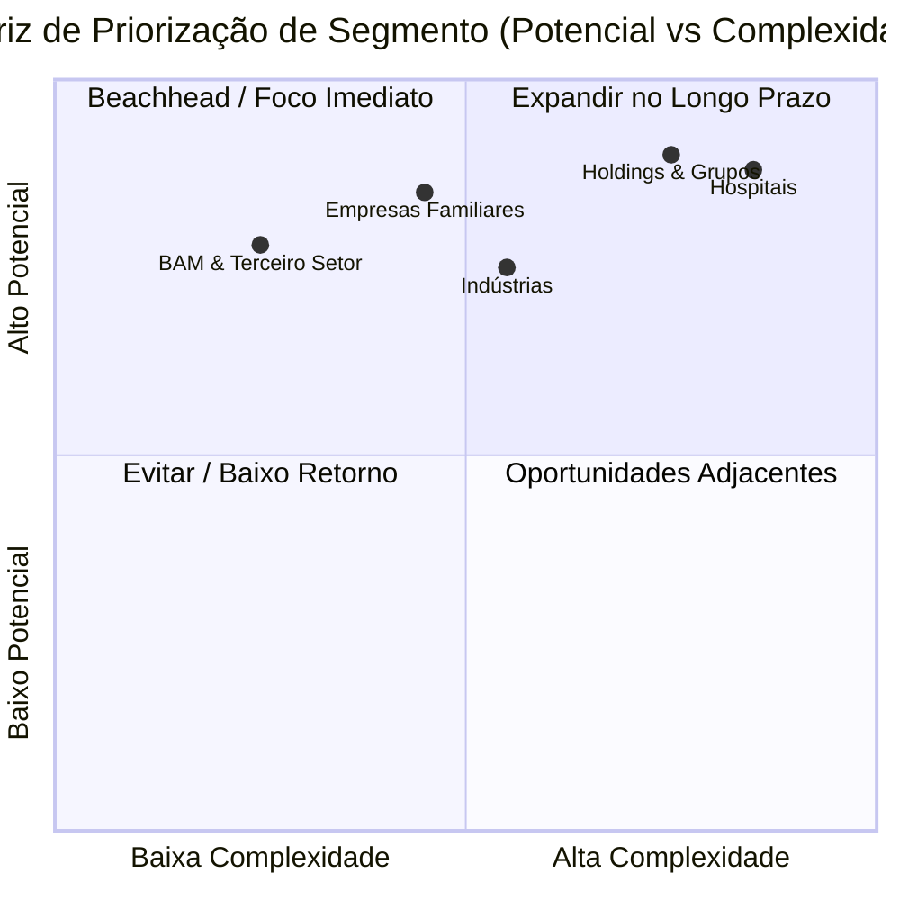

# Governance Go-To-Market Strategy v1.0

**Illumine Governance™ – Estratégia de Entrada no Mercado para os Primeiros 24 Meses**
**Document ID:** GTM-STRATEGY-2026-V1  
**Release Date:** June 2026  
**Confidentiality:** Interna / Restrita  

---

> [!NOTE]
> *Este documento formaliza a estratégia oficial de entrada no mercado (Go-To-Market) da plataforma Illumine Governance™ para o período de 2026-2028. Seu propósito é direcionar os esforços de vendas, posicionamento de autoridade e aquisição de clientes com base em segmentação estratégica de foco.*

---

## 1. Goal Description

Definir a estratégia oficial de entrada no mercado do **Illumine Governance™** para os primeiros 24 meses de operação comercial. 

Este documento responde a perguntas críticas de eficiência de tração:
* **Para quem vender primeiro?** (Identificação do mercado de teste/beachhead).
* **Quem sente a maior dor no mercado atual?** (Perfil de cliente ideal ou ICP).
* **Quem possui o menor ciclo de vendas?** (Velocidade de fechamento contratual).
* **Quem gera a maior autoridade institucional para a marca?** (Estudos de caso de prestígio).
* **Quem gera a receita recorrente mais sustentável?** (Preservação de LTV e controle de Churn).

---

## 2. Strategic Principle

### A Disciplina do Foco

O Illumine Governance™ não deve iniciar tentando atender todos os mercados ou tipos de organizações simultaneamente. Tentativas de vender uma plataforma corporativa complexa sem foco setorial diluem o valor percebido, esticam o ciclo de vendas e sobrecarregam o time de suporte consultivo.

A estratégia inicial de Go-To-Market baseia-se no **foco cirúrgico**:
1. **Dominar e validar um nicho específico** (o *Beachhead Market*).
2. **Consolidar estudos de caso de sucesso** e refinar as bases cognitivas (e.g., IWL - Institutional Wisdom Library).
3. **Expandir progressivamente** para outros segmentos adjacentes à medida que a credibilidade metodológica é estabelecida no mercado.

---

## 3. Market Segmentation & Prioritization Matrix

Abaixo está o mapeamento dos cinco segmentos-alvo identificados para a plataforma:



### Segmento 01: Empresas Familiares
* **Principais Dores:** Planejamento sucessório conturbado, dependência extrema da figura dos sócios-fundadores, transição para gestão profissionalizada, conflitos societários de tomada de decisão e preservação do legado familiar.
* **Potencial de Mercado:** Alto.
* **Complexidade Comercial:** Média.
* **Prioridade:** **ALTA**.

### Segmento 02: Holdings e Grupos Empresariais
* **Principais Dores:** Controle e governança multi-empresa ou multi-tenant, visibilidade de riscos sistêmicos consolidados, proteção patrimonial entre controladoras e subsidiárias, e padronização de reports para conselhos.
* **Potencial de Mercado:** Muito Alto.
* **Complexidade Comercial:** Alta.
* **Prioridade:** **ALTA** (Foco corporativo).

### Segmento 03: Organizações BAM (Business as Mission) e Terceiro Setor
* **Principais Dores:** Tensão crônica entre a expansão do impacto (missão) e a sustentabilidade financeira, alta dependência de fontes concentradas de captação/doações, e risco de descontinuidade institucional.
* **Potencial de Mercado:** Alto (Foco em nicho de autoridade).
* **Complexidade Comercial:** Baixa.
* **Prioridade:** **MUITO ALTA** (Catalisador de cases rápidos).

### Segmento 04: Hospitais
* **Principais Dores:** Complexidade regulatória excessiva, processos operacionais de alto risco (vida humana), custos inflacionados e margens apertadas sob contratos de planos de saúde.
* **Potencial de Mercado:** Muito Alto.
* **Complexidade Comercial:** Muito Alta.
* **Prioridade:** **MÉDIA** (Foco a partir do segundo ano).

### Segmento 05: Indústrias
* **Principais Dores:** Estrangulamento de capital de giro (ciclo financeiro longo), dependência sucessória técnica de processos chaves e necessidade de resiliência ante oscilações macroeconômicas.
* **Potencial de Mercado:** Alto.
* **Complexidade Comercial:** Média.
* **Prioridade:** **ALTA**.

---

## 4. Beachhead Market (O Ponto de Entrada)

Nos primeiros 12 meses, os esforços de tração comercial serão focados em dois nichos estratégicos:

> [!TIP]
> **1. Empresas Familiares**  
> **2. Organizações BAM (Business as Mission)**

### Racional de Escolha:
* **Aderência Metodológica:** Ambos os setores possuem o alinhamento da missão corporativa (*Mission* do ESGIM™) e a integridade de princípios como valores inegociáveis.
* **Acesso Facilitado:** Redução de fricção de vendas aproveitando a rede de relacionamentos existente da liderança do Illumine.
* **Ciclo de Vendas Reduzido:** Decisões concentradas em poucos tomadores de decisão (fundadores, patriarcas ou conselhos familiares reduzidos), evitando processos de compras (Procurement) corporativos excessivamente burocráticos.
* **Geração de Prova Social:** Facilidade de mapeamento de resultados e construção rápida de estudos de caso para legitimar a plataforma.

---

## 5. Commercial Offer Structure

Para mitigar a barreira de entrada da venda consultiva, a oferta foi dividida em duas etapas:

```
[ Entry Product: Avaliação Institucional Inicial ] ──(30 dias)──► Conversão para Mensalidade
                                                                        │
                                                                        ▼
                                                       [ Expansion: Governance Roadmap / Advisory ]
```

### Produto de Entrada (Entry Product): Avaliação Institucional Inicial
* **Duração:** 30 dias.
* **Racional:** Baixa barreira de preço e esforço para o cliente. Serve como teste de alinhamento e credibilidade.
* **Entregáveis Finais:**
  * **ESGIM™ Assessment:** Diagnóstico integrado da organização.
  * **Risk Map:** Mapeamento visual de fragilidades fiduciárias ou institucionais.
  * **Board Priorities:** Recomendações acionáveis em horizontes temporais estruturados.
  * **Institutional Resilience Report:** Diagnóstico de processos e sucessão.
  * **Executive Advisory:** Sessão de entrega com advisors do Illumine.

### Produtos de Expansão (Expansion Products):
Após a entrega da Avaliação Inicial e demonstração das dores reais, a organização é convertida para contratos de longo prazo:
* **Governance Roadmap:** Execução e acompanhamento do plano de remediação de governança.
* **Advisory Mensal:** Reuniões mensais com os advisors utilizando os dashboards e dados consolidados da plataforma.
* **Board Support:** Monitoramento contínuo das decisões do conselho.
* **ESGIM™ Monitoring Platform:** Acesso SaaS multi-tenant contínuo para visualização diária de dados.

---

## 6. Authority Building Strategy

A plataforma não será comercializada via publicidade tradicional ou outbound agressivo. A captação de leads enterprise baseia-se em **Construção de Autoridade**:

1. **Executive Discovery Workshops:** Encontros focados em debater o *Paradoxo do Crescimento* com grupos seletos de CEOs e conselheiros.
2. **Estudos de Caso:** Publicação de relatórios (anonimizados) sobre como a plataforma evitou colapsos financeiros ou sucessórios de empresas conhecidas.
3. **White Papers:** Documentação metodológica periódica sobre governança baseada em Inteligência Artificial.
4. **Artigos Científicos e Corporativos:** Publicações sobre o framework ESGIM™ em veículos voltados a Conselhos de Administração.

---

## 7. First 10 Clients Strategy

O objetivo comercial dos primeiros 10 clientes fechados **não é o faturamento absoluto**, mas sim a validação prática da ferramenta em campo:
* **Refinamento Epistemológico:** Calibrar a sensibilidade dos motores da *Causal Governance* e *Prospective Governance* com dados industriais reais.
* **Geração de Cases:** Coleta de depoimentos (sociedade, conselho, C-Level) comprovando melhoria na resiliência organizacional.
* **Validação de Valor:** Refinar o preço da assinatura de monitoramento permanente (LTV).

---

## 8. Success Metrics

### Primeiros 12 Meses (Fase de Consolidação):
* **10 Avaliações Institucionais** concluídas.
* **5 Contratos Recorrentes (Advisory/SaaS)** estabelecidos a partir das avaliações.
* **3 Estudos de Caso** de alta qualidade publicados (anonimizados).
* **1 Benchmark ESGIM™ Setorial** gerado para servir de ativo de atração no segmento de Empresas Familiares.

---

## 9. Strategic Conclusion

O Illumine Governance™ **não será vendido como software**. O software é a infraestrutura de suporte; a proposta comercial de valor deve focar na entrega de **discernimento institucional**.

```
  O Software ─────────────► É o MEIO de consolidação e auditoria cognitiva.
  A Clareza Executiva ────► É o PRODUTO adquirido pelo C-Level e pelo Conselho.
  A Longevidade ──────────► É o RESULTADO final da governança implementada.
```

O Illumine Governance™ resolve a miopia corporativa. Entrar no mercado com o posicionamento consultivo de discernimento de riscos garante o status de autoridade inquestionável perante conselhos e investidores de grande porte.
