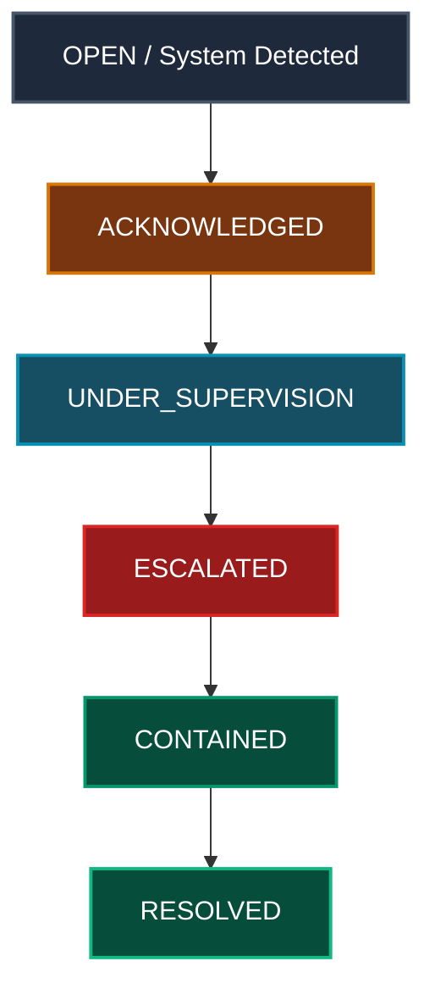

# Protocolo de Operações de Governança e Monitoramento (GCC)

Este protocolo define os padrões formais e diretrizes operacionais para a supervisão de incidentes fiduciários, monitoramento de saúde do runtime e execução de comandos executivos através do **Governance Command Center (GCC)**.

---

## 1. Princípios Fundamentais

### 1.1 Imutabilidade de Incidentes
Os incidentes capturados pelo runtime representam fatos históricos fiduciários consolidados.
- **REGRA DE OURO**: Um registro de incidente original **nunca** deve ser mutado ou deletado.
- Todas as transições de estado (`ACKNOWLEDGED`, `UNDER_SUPERVISION`, `ESCALATED`, `CONTAINED`, `RESOLVED`) devem ser gravadas na forma de eventos de supervisão append-only vinculados ao ID do incidente original.

### 1.2 Isolamento de Dados (Tenancy)
O monitoramento multi-inquilino é estritamente restrito a assessores e administradores master devidamente autenticados e autorizados. Qualquer acesso ou leitura cross-tenant deve ser logado pelo `TenantAuditLogger`.

---

## 2. Ciclo de Vida do Incidente (Event-Sourced)

O status atual de qualquer incidente é derivado dinamicamente do fluxo acumulativo de eventos de supervisão (`GovernanceSupervisionEvent`):

Cada evento de supervisão deve registrar:
- `incidentId`: Link inequívoco ao incidente.
- `tenantId` & `correlationId` & `lineageHash`: Garantia de integridade e auditoria contábil.
- `actorId`: Responsável pela ação.
- `timestamp`: Momento exato da transação fiduciária.

---

## 3. Monitoramento de Saúde do Runtime e Fail-Closed

O GCC consome o estado de integridade do Runtime continuamente. Se qualquer indicador de segurança for corrompido, o monitor aciona imediatamente a postura de bloqueio:

### 3.1 Gatilhos do Fail-Closed
- **Ausência de Lineage**: Incidentes ou telemetria sem `lineageHash` ou `correlationId` válidos.
- **Desconexão de Telemetria**: Perda de fluxo contínuo de dados de runtime.
- **Trânsito Cross-Tenant sem Relação**: Violação nas fronteiras lógicas do multi-tenant.

### 3.2 Comportamento em FAIL_CLOSED
1. **Lockdown de Ações**: Todas as operações de comando (Acknowledge, Escalate, Contain, Resolve) são desabilitadas na fila de incidentes.
2. **Visualização Virtualizada**: Todos os incidentes ativos exibem o status temporário `FAIL_CLOSED`.
3. **Alerta de Degradação**: Exibição proeminente de banners vermelhos sinalizando risco de quebra de auditoria.

---

## 4. Pacing Cognitivo Executivo

Para mitigar a fadiga de decisão de CEOs e CFOs, o GCC implementa filtragem inteligente de alertas:
- **Alertas Críticos** (`SYSTEMIC`, `CRITICAL`): Sempre visíveis na fila principal.
- **Alertas Secundários** (`HIGH`, `MODERATE`, `LOW`): São dinamicamente colapsados se o número de incidentes críticos exceder a capacidade visual programada. Eles permanecem acessíveis, mas não demandam atenção imediata na interface inicial.
