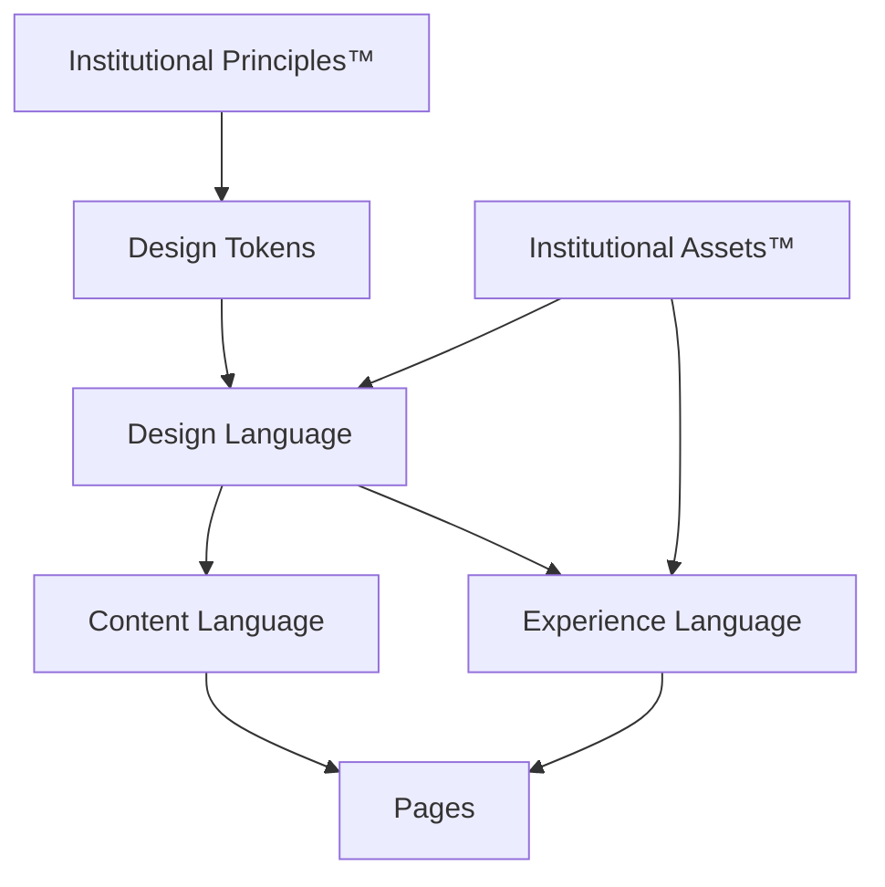

# Illumine Institutional Experience Architecture™ (IEXA)
**Version:** 1.0.0

A Illumine atua como um Sistema Operacional Executivo. Para sustentar esse posicionamento e alinhar-se à categoria de plataformas Enterprise (Palantir, Datadog, Stripe), a interface pública é regida por uma constituição visual viva.

## Arquitetura de Dependências

A IEXA opera de maneira estritamente descendente. As 8 Camadas evoluem através deste fluxo de dependência:



## As 8 Camadas da IEXA

### 1. Institutional Principles™
A camada fundacional e permanente que dita a percepção da marca.
- **Simplicidade & Clareza**
- **Precisão Tecnológica e Engenharia**
- **Densidade de Informação Focada**
- **Confiança e Sofisticação Executiva**
- **Progressive Disclosure™:** Revelar a complexidade em camadas, de acordo com a profundidade da jornada do visitante.

### 2. Institutional Design Tokens™
A fonte de verdade absoluta. Valores "mágicos" (`text-5xl`, `py-32`) não existem na aplicação.
- **Physical Tokens:** Valores físicos brutos (HEX, escala, px, motion, radius).
- **Semantic Tokens:** Intenções mapeadas (`hero.title`, `surface.primary`).

### 3. Institutional Assets™
A biblioteca visual centralizada. Todo ativo visual deve obedecer à IEXA.
- **Local:** `assets/` (illustrations, executive-scenes, textures, videos, icons, logos).

### 4. Institutional Design Language™
Componentes visuais agnósticos de domínio que constroem a interface através dos Tokens.
- **Estrutura:** `<PageFrame>`, `<Container>`, `<Grid>`, `<Stack>`.
- **UI:** `<Typography>`, `<Surface>`, `<Card>`, `<Section>`, `<Hero>`, `<List>`, `<Divider>`.

### 5. Institutional Content Language™
Componentes organizados por intenção e domínio da comunicação:
- **Strategic:** `<ManifestoText>`, `<Narrative>`, `<Insight>`
- **Executive:** `<Evidence>`, `<Finding>`, `<Recommendation>`, `<Decision>`
- **Governance & Advisory:** `<GovernanceStatement>`, `<AdvisoryRecommendation>`
- **Research:** `<ResearchEvidence>`, `<Thesis>`
- **Marketing & Legal:** `<Benefits>`, `<CTA>`, `<SocialProof>`, `<PrivacyPolicy>`, `<Terms>`

### 6. Institutional Experience Language™
Padroniza o comportamento, física da interface, densidade e atenção.
- **Information Density:** `comfortable`, `compact`, `immersive`.
- **Attention Management:** Controle sobre o que chama atenção primeiro, duração do foco, o que pode piscar e o que *nunca* deve piscar.
- **Perceived Performance:** Skeletons, Streaming, Lazy Loading, Optimistic Rendering.
- **Módulos Físicos:** Motion, Hover States, Reveal, Progressive Disclosure, Scrolling, Microinteractions.

### 7. Institutional Composition Grammar™
Uma DSL (Domain Specific Language) que obriga o storytelling estrutural.
- **Exemplo de DSL de Página:**
  ```tsx
  <Page>
    <PageHero />
    <Problem />
    <Consequence />
    <NewPerspective />
    <Resolution />
    <Evidence />
    <Trust />
    <CTA />
  </Page>
  ```
- **Limitações Formais:** Títulos ≤ 3 linhas. Parágrafos ≤ 72 caracteres. Apenas um ponto focal visual por seção.

### 8. Institutional Copy Standards™
Guia oficial da identidade textual e editorial.
- **Terminologia:** Proibido (Ferramenta, Software, Usuário). Desejado (Plataforma, Inteligência, Conselho).
- **Voice:** Correto ("A plataforma identifica..."). Errado ("Nossa IA faz...").
- **Tone:** Sempre consultivo, executivo, objetivo. Nunca vendedor ou publicitário.
- **Style:** Frases curtas, voz afirmativa, verbo ativo, substantivos fortes. Evitar excesso de adjetivos, marketing inflado e hipérboles.

## Governança (Architecture Gate)
> [!CAUTION]
> **Compatibilidade:** Toda alteração na IEXA requer compatibilidade retroativa ou plano formal de migração (versionamento).
> **Níveis de Estabilidade dos Componentes:**
> - `Stable` (ex: `InstitutionalHero™`)
> - `Experimental` (ex: `ExecutiveTimeline™`)
> - `Deprecated` (ex: `InstitutionalTitle™`)
> **Regra de Composição:** Páginas apenas compõem componentes canônicos da IEXA. Não podem redefinir comportamento, aparência visual ou semântica através de classes ou estilos _ad-hoc_. O sistema é estritamente *descendente*.
