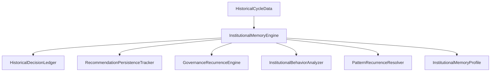

# Institutional Memory Engine (RC-1.2A)

A **Institutional Memory Engine** é a camada arquitetural do ecossistema Illumine responsável por transicionar o modelo analítico de avaliações isoladas (*snapshots* contínuos) para **Inteligência Institucional Evolutiva**. Esta engine compreende a trajetória, a recorrência de desvios e o comportamento decisório da organização ao longo do tempo.

---

## 1. Princípios de Governança Epistemológica

Para garantir que a análise evolutiva seja fiduciariamente justificável, a Institutional Memory Engine opera sob quatro mandatos fundamentais:

### I. Memória Ativa vs. Histórico Decorativo
A memória institucional não se limita a renderizar uma timeline estática ou logs de auditoria passivos. Ela calcula padrões de persistência e recorrência temporal que interferem diretamente nos cálculos de score, classificação de severidade e suficiência contextual do runtime.

### II. Segregação de Responsabilidades Categoriais
As responsabilidades da engine são estritamente separadas em quatro divisões funcionais para evitar a mistura de conceitos contábeis brutos com julgamentos táticos:
* **Ledger Histórico (Fato Bruto)**: Registra decisões fiduciárias e violações de compliance em formato *append-only* imutável.
* **Memory Engine (Padrões Interpretados)**: Identifica recorrências consecutivas e persistência estrutural de riscos.
* **Temporal Inference (Tendência Direcional)**: Determina se a organização está em um vetor de *deterioração*, *recuperação consistente*, *inflexão* ou *estabilização*.
* **Executive Runtime (Advisory)**: Transforma os padrões interpretados em notas finais, impactos no score e recomendações reguladas.

### III. Inferência Factual Objetiva (Sem Julgamento Humano)
É terminantemente proibido imputar intenções subjetivas, psicológicas ou de conduta a gestores humanos. Toda conclusão deve ter rastreabilidade e base puramente factual.

*   **Exemplo Permitido (Factual)**:
    > "Recomendação de redução de alavancagem emitida em 3 ciclos consecutivos sem evidência de mitigação."
*   **Exemplo Proibido (Subjetivo/Julgamento)**:
    > "A diretoria é resistente a mudanças e demonstra inabilidade em seguir o plano proposto."

### IV. Fail-Closed Absoluto de Histórico
A análise de tendências temporais exige densidade histórica comprovável.
*   **Se o histórico possuir menos de 3 ciclos operacionais (ciclos < 3)**:
    *   Nenhuma inferência de deterioração progressiva ou recuperação consistente será processada.
    *   Nenhum score sofrerá penalização por reincidência.
    *   A confiança estratégica não será degradada por recorrências inexistentes.
    *   O perfil de memória retornará: **"Histórico insuficiente para inferência evolutiva."**

---

## 2. Visão Geral da Arquitetura

O fluxo de dados da camada de memória institucional segue uma hierarquia de orquestração interna no diretório `src/core/runtime/institutional-memory/`:

### Componentes Core

1.  **`HistoricalDecisionLedger.ts`**
    Repositório oficial para registro de aprovações, deliberações e violações. É blindado contra qualquer alteração ou remoção de dados históricos. Métodos de atualização e deleção lançam `MUTATION_PROHIBITED`.
2.  **`RecommendationPersistenceTracker.ts`**
    Monitora se a mesma recomendação de controle/mitigação vem sendo emitida de forma consecutiva nos ciclos operacionais.
3.  **`GovernanceRecurrenceEngine.ts`**
    Agrega violações recorrentes (como violações críticas do tipo `Runway` ou `Systemic`) e calcula o nível de severidade acumulada (`LOW_RECURRENCE`, `MODERATE_RECURRENCE`, `HIGH_RECURRENCE`, `CRITICAL_STRUCTURAL_RECURRENCE`).
4.  **`InstitutionalBehaviorAnalyzer.ts`**
    Realiza a leitura de balanços históricos de forma factual e sem subjetividade, identificando anomalias estruturais recorrentes:
    *   *Postergação de Decisão*: Recomendações emitidas consecutivamente sem resolução.
    *   *Crescimento Sem Reforço*: Crescimento relevante do ativo circulante (como estoques) sem aporte proporcional no PL.
    *   *Dependência Recorrente*: Dependência consecutiva de financiamentos de terceiros para cobrir caixa operacional.
5.  **`PatternRecurrenceResolver.ts`**
    Define a trajetória matemática global da organização (Inflexão, Estabilização, Recuperação Consistente ou Deterioração Progressiva) baseada no comportamento do score composto.

---

## 3. Impacto nos Scores e Confiança Fiduciária

O runtime integra os dados calculados pelo `InstitutionalMemoryProfile` no `ExecutiveGovernanceRuntime` sob as seguintes regras fiduciárias:

### Penalidades de Score Composto e Estrutural
Caso a recorrência de desvios atinja níveis elevados, penalidades são aplicadas diretamente às notas estruturais e ao score composto (refletidas harmonicamente em toda a UI):
*   `CRITICAL_STRUCTURAL_RECURRENCE` $\rightarrow$ **-15 pontos** de penalidade.
*   `HIGH_RECURRENCE` $\rightarrow$ **-10 pontos** de penalidade.
*   `MODERATE_RECURRENCE` $\rightarrow$ **-5 pontos** de penalidade.

### Degradação de Confiança
Se houver uma recorrência crítica ativa, o nível de confiança da engine de reincidência (`recurrenceConfidence`) cai para `LOW`, o que sinaliza ao runtime uma degradação preventiva do nível global de confiança da análise.
