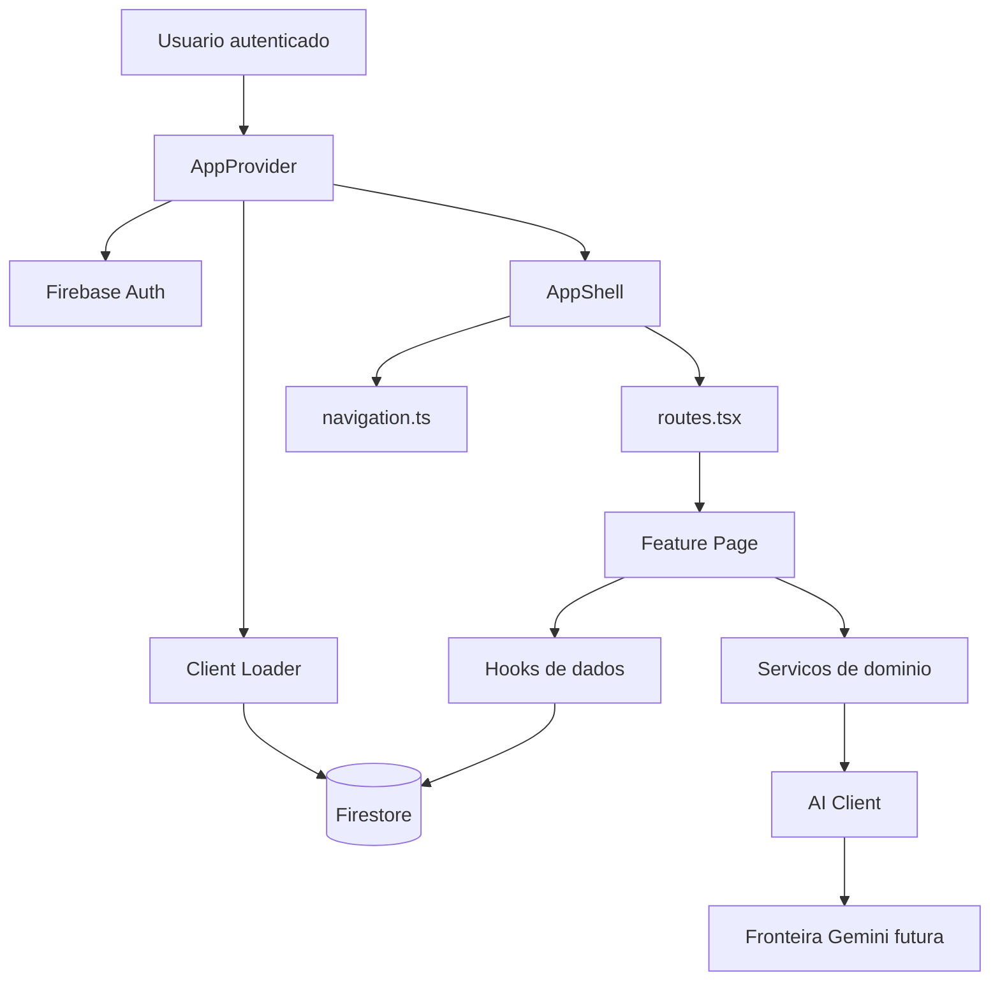

# DOCUMENTAÇÃO DERIVADA

Esta pasta contém documentação operacional, técnica e funcional derivada da ARQUITETURA_MESTRA_ILLUMINE.md.

Em caso de conflito:
A ARQUITETURA_MESTRA_ILLUMINE.md prevalece.

## Financial Governance Engine

Toda regra de cálculo financeiro, classificação patrimonial, análise de liquidez, estrutura de capital, capital de giro, scoring, stress tests, valuation e advisory narratives deve seguir obrigatoriamente o documento:

`MASTER_FINANCIAL_GOVERNANCE_ENGINE.md`

A Financial Governance Engine é a fonte oficial de:

- indicadores financeiros;
- fórmulas patrimoniais;
- regras de liquidez;
- classificação de severidade;
- taxonomia de ativos;
- score patrimonial;
- curadoria financeira;
- regras de continuidade empresarial;
- narrativas automáticas de advisory.

Nenhum módulo, dashboard, componente ou card pode criar fórmulas próprias divergentes da engine oficial.

Em caso de conflito entre lógica local e a Financial Governance Engine, prevalece a regra definida em:

`MASTER_FINANCIAL_GOVERNANCE_ENGINE.md`

---

# Illumine Governance Brownfield Enhancement Architecture

> Status: baseline arquitetural brownfield em modo YOLO
> Data: 2026-05-09
> Owner: Architect

## 1. Introducao

Este documento define a arquitetura brownfield para evoluir o Illumine Governance sem quebrar o comportamento existente. A aplicacao foi importada do Google AI Studio e hoje funciona como uma SPA React/Vite com Firebase Auth, Firestore e integracao Gemini no cliente.

O objetivo arquitetural mais adequado para a aplicacao agora e estabilizar a base antes de ampliar escopo funcional: reduzir acoplamento em `src/App.tsx`, formalizar fronteiras de dados, preservar as regras Firestore, melhorar testabilidade e preparar uma fronteira de servidor para chamadas Gemini que envolvam dados sensiveis.

Este documento complementa os artefatos existentes em `docs/architecture/`. Quando houver conflito entre uma recomendacao nova e o codigo atual, a regra e preservar compatibilidade primeiro e extrair em passos pequenos.

### Entradas Validadas

- `brownfield-prd.md`: nao encontrado. Por isso, este documento nao inventa uma nova feature; ele formaliza a arquitetura de estabilizacao ja indicada pelo codigo e pelos docs.
- Documentacao existente: `README.md`, `security_spec.md`, `docs/architecture/source-tree.md`, `docs/architecture/decisions.md`, `docs/architecture/data-boundaries.md`.
- Codigo analisado: `src/App.tsx`, `src/lib/firebase.ts`, `src/services/advisoryAiService.ts`, `functions/index.js`, `firestore.rules`, `vite.config.ts`, `package.json`.

### Change Log

| Change | Date | Version | Description | Author |
| --- | --- | --- | --- | --- |
| Baseline inicial | 2026-05-07 | 0.1 | Estrutura draft criada a partir do projeto importado | Architect |
| Consolidacao YOLO | 2026-05-09 | 1.0 | Arquitetura brownfield completa em portugues, orientada a extracao incremental | Aria |

## 2. Analise do Projeto Existente

### Current Project State

- **Primary Purpose:** dashboard de strategic advisory e CFO-as-a-service para gestao financeira, portfolio de clientes, demonstracoes, planejamento, diagnostico, OKRs, precificacao, relatorios executivos e insights.
- **Current Tech Stack:** React 19.0.1, Vite 6.2.3, TypeScript ~5.8.2, Tailwind CSS 4.1.14 via Vite plugin, Firebase Auth, Firestore, Google GenAI, Recharts, Motion, XLSX, pdfjs-dist, html2canvas, jsPDF.
- **Architecture Style:** SPA client-side com estado local de pagina, navegacao e shell em `src/App.tsx`, paginas em `src/components/pages`, hooks de dados em `src/hooks`, servicos utilitarios em `src/services`, acesso Firestore direto no browser, API de advisory acionada por endpoint configuravel e dados estaticos de fallback.
- **Deployment Method:** build estatico Vite para `dist/`; arquivos Firebase existem (`firebase.json`, `.firebaserc`, `firestore.rules`, `firestore.indexes.json`), mas pipeline CI/CD e estrategia de ambientes ainda nao estao formalizados.

### Available Documentation

- `README.md`: origem AI Studio, setup local e referencias AIOX.
- `security_spec.md`: invariantes de seguranca Firestore e payloads adversariais.
- `docs/architecture/source-tree.md`: estrutura atual e alvo de extracao.
- `docs/architecture/decisions.md`: ADRs aceitas/propostas.
- `docs/architecture/data-boundaries.md`: colecoes Firestore e regras de fronteira.

### Identified Constraints

- Sem PRD brownfield formal, a arquitetura deve limitar-se a estabilizacao e preparacao para evolucao.
- `src/App.tsx` concentra imports de paginas, navegacao, auth, carregamento de clientes, layout, roteamento e estado global da UI.
- Firestore rules sao contrato arquitetural: ownership, timestamps e validacao de campos nao podem ser relaxados por conveniencia de UI.
- O browser chama um endpoint configuravel por `VITE_ADVISORY_API_URL` para gerar pareceres. A chave Gemini deve permanecer apenas no runtime de Functions/API, nunca no bundle.
- Os scripts `lint`, `typecheck` e `test` executam `tsc --noEmit`; ainda nao ha testes unitarios, de regras Firestore ou smoke tests reais.
- IDs de paginas e nomes de colecoes Firestore devem permanecer estaveis durante a extracao.

## 3. Escopo de Enhancement e Estrategia de Integracao

### Enhancement Overview

**Enhancement Type:** estabilizacao brownfield e extracao arquitetural incremental.

**Scope:** separar shell, navegacao, rotas, providers, acesso a dados e servicos de AI sem alterar fluxos visiveis ao usuario.

**Integration Impact:** medio. O risco nao esta em uma grande mudanca de tecnologia, mas em mexer numa aplicacao ampla com muitas telas, Firestore rules restritivas e integracoes distribuidas.

### Integration Approach

**Code Integration Strategy:** extrair primeiro metadados e roteamento de `src/App.tsx`, depois providers/auth/client loading, depois reorganizar dominios em `src/features/`. Cada etapa deve compilar isoladamente.

**Database Integration:** manter colecoes atuais. Qualquer mudanca de schema deve passar por revisao de dados, regra Firestore, plano de migracao e validacao contra `security_spec.md`.

**API Integration:** manter Firebase SDK no cliente no curto prazo. Consolidar a fronteira server-side ja iniciada para Gemini, usando Firebase ID token, secrets no runtime e contrato HTTP testavel.

**UI Integration:** preservar sidebar, grupos, labels, IDs de pagina e comportamento atual. Reorganizacao de arquivos nao deve redesenhar experiencia.

### Compatibility Requirements

- **Existing API Compatibility:** manter chamadas Firebase SDK atuais ate que adaptadores de servico estejam prontos.
- **Database Schema Compatibility:** nao renomear colecoes nem campos estrategicos sem migracao.
- **UI/UX Consistency:** preservar navegacao, layout principal e transicoes durante a extracao.
- **Performance Impact:** novas extracoes devem reduzir pressao de bundle por lazy loading; nao introduzir bibliotecas pesadas sem necessidade.

## 4. Tech Stack Alignment

### Existing Technology Stack

| Category | Current Technology | Version | Usage in Enhancement | Notes |
| --- | --- | --- | --- | --- |
| Frontend | React | 19.0.1 | Manter | Nao ha justificativa para migrar framework. |
| Build | Vite | 6.2.3 | Manter | Build atual funciona e suporta code splitting. |
| Language | TypeScript | ~5.8.2 | Manter e apertar tipos | Evitar `any` em novas fronteiras. |
| Styling | Tailwind CSS | 4.1.14 | Manter | Nao adicionar outro sistema visual. |
| Auth | Firebase Auth | 12.12.1 | Manter | Google sign-in ja integrado. |
| Database | Firestore | 12.12.1 | Manter | Regras sao parte do contrato. |
| AI | Google GenAI | 1.29.0 | Manter no backend/API | O cliente deve chamar endpoint; a API key nao deve ir para o bundle. |
| Charts | Recharts | 3.8.1 | Manter | Adequado para dashboards atuais. |
| Animation | Motion | 12.23.24 | Manter com parcimonia | Ja usado no shell e transicoes. |
| Importacao | XLSX, pdfjs-dist | lockfile atual | Isolar em servicos | Parsing deve ter testes. |
| Exportacao | html2canvas, jsPDF | lockfile atual | Isolar em servicos | Relatorios devem ficar fora das paginas quando crescerem. |

### New Technology Additions

Nenhuma tecnologia nova e obrigatoria para a primeira fase. A unica adicao recomendada apos a extracao inicial e **Vitest**, para testes de utilitarios, servicos e hooks, porque o projeto ja usa Vite e hoje `npm test` apenas executa TypeScript.

## 5. Data Models and Schema Changes

### New Data Models

Nao ha novos modelos obrigatorios neste enhancement. A decisao correta e formalizar os modelos existentes antes de ampliar schema.

### Schema Integration Strategy

**Database Changes Required:**

- **New Tables/Collections:** nenhuma na fase de estabilizacao.
- **Modified Tables/Collections:** nenhuma sem story especifica e plano de migracao.
- **New Indexes:** usar `firestore.indexes.json` apenas quando uma query real exigir.
- **Migration Strategy:** toda migracao deve ter backup/export, script idempotente, rules atualizadas e validacao em ambiente separado.

**Backward Compatibility:**

- Preservar `clients`, `financial_entries`, `account_plans`, `client_assumptions`, `indicators`, `financial_positions`, `purchases`, `payables`, `receivables`, `employees`, `report_notes`, `loans`, `diretrizes`, `diagnostico`, `okrs`, `precificacao`.
- Manter `ownerId`, `createdBy`, `clientId`, `createdAt` e `updatedAt` coerentes com `firestore.rules`.
- Nao permitir writes que dependam de timestamp manual quando a regra exige `request.time`.

## 6. Component Architecture

### New Components

#### `src/app/navigation.ts`

**Responsibility:** concentrar grupos de navegacao, IDs, labels, icones e flags visuais.

**Integration Points:** substitui o `useMemo` de navegacao em `src/App.tsx`.

**Key Interfaces:**

- `type PageId`
- `type NavigationGroup`
- `NAVIGATION_GROUPS`

**Dependencies:**

- **Existing Components:** icones `lucide-react`.
- **New Components:** `routes.tsx`, `AppShell.tsx`.

#### `src/app/routes.tsx`

**Responsibility:** mapear `PageId` para componente de pagina e props esperadas.

**Integration Points:** substitui condicionais `currentPage === ...` em `src/App.tsx`.

**Key Interfaces:**

- `renderPage(pageId, appContext)`
- `PageRouteContext`

**Dependencies:**

- **Existing Components:** todas as paginas em `src/components/pages`.
- **New Components:** futuro lazy loading por pagina.

#### `src/app/AppShell.tsx`

**Responsibility:** renderizar sidebar, header, area principal e controles globais.

**Integration Points:** recebe estado e callbacks do container/provider.

**Key Interfaces:**

- `currentPage`
- `setCurrentPage`
- `selectedClient`
- `user`
- `authLoading`

#### `src/app/providers.tsx`

**Responsibility:** centralizar auth, carregamento de clientes, mes/ano selecionados e contexto compartilhado.

**Integration Points:** substitui efeitos de auth/client loading em `src/App.tsx`.

**Key Interfaces:**

- `AppProvider`
- `useAppContext`

#### `src/services/ai/advisoryAiClient.ts`

**Responsibility:** preservar contrato atual de geracao de parecer, autenticando usuario e chamando endpoint server-side configuravel.

**Integration Points:** consolidar `src/services/advisoryAiService.ts` como cliente HTTP e manter `functions/index.js` como fronteira de execucao Gemini.

### Component Interaction Diagram



## 7. API Design and Integration

### API Integration Strategy

**API Integration Strategy:** Firebase Auth e Firestore permanecem como backend gerenciado para dados. A geracao de advisory deve passar por endpoint server-side, ja iniciado no codigo, para proteger a chave Gemini e permitir auditoria.

**Authentication:** manter Firebase Auth no cliente; server boundary futura deve validar Firebase ID token.

**Versioning:** nao aplicavel para Firestore direto. Para endpoints futuros, usar versionamento por caminho apenas se houver consumidores externos; internamente, preferir contratos TypeScript e testes.

### New API Endpoints

#### `generate-advisory-report` Futuro

- **Method:** `POST`
- **Endpoint:** `/api/generate-advisory-parecer` por padrao, sobrescrito por `VITE_ADVISORY_API_URL` quando necessario.
- **Purpose:** gerar parecer executivo sem expor API key Gemini no bundle e com possibilidade de auditoria, rate limit e redacao de dados.
- **Integration:** `src/services/advisoryAiService.ts` obtem Firebase ID token e chama o endpoint.

Request:

```json
{
  "clientId": "string",
  "month": "string",
  "year": 2026,
  "metrics": {},
  "patterns": [],
  "context": {}
}
```

Response:

```json
{
  "text": "string",
  "model": "string",
  "generatedAt": "string"
}
```

## 8. External API Integration

### Firebase Auth API

- **Purpose:** autenticacao Google.
- **Documentation:** Firebase Auth.
- **Authentication:** Google provider.
- **Integration Method:** Firebase client SDK.
- **Error Handling:** erros devem ser tratados em camada de auth/provider, nao espalhados em paginas.

### Firestore API

- **Purpose:** persistencia de dados consultivos por cliente.
- **Authentication:** Firebase Auth + Firestore Security Rules.
- **Integration Method:** Firebase client SDK.
- **Error Handling:** centralizar `handleFirestoreError` e evitar expor detalhes sensiveis em UI.

### Google GenAI API

- **Purpose:** gerar pareceres executivos e insights.
- **Authentication:** API key Gemini.
- **Integration Method Atual:** endpoint server-side acionado por `src/services/advisoryAiService.ts`.
- **Integration Method Alvo:** manter secret fora do bundle, validar ID token e adicionar observabilidade/rate limit.
- **Error Handling:** fallback textual ja existe; alvo deve adicionar logs seguros, rate limit e circuit breaker simples.

## 9. Source Tree Integration

### Existing Project Structure

```plaintext
src/
├── App.tsx
├── main.tsx
├── components/
│   ├── Common.tsx
│   ├── EmployeeManager.tsx
│   ├── PayrollDashboard.tsx
│   ├── modals/
│   └── pages/
├── data/
├── hooks/
├── lib/
├── services/
└── types/
```

### New File Organization

```plaintext
src/
├── app/
│   ├── AppShell.tsx
│   ├── navigation.ts
│   ├── providers.tsx
│   └── routes.tsx
├── features/
│   ├── advisory/
│   ├── clients/
│   ├── finance/
│   ├── reports/
│   ├── strategy/
│   └── payroll/
├── shared/
│   ├── components/
│   ├── hooks/
│   ├── lib/
│   └── types/
├── services/
│   ├── ai/
│   ├── firebase/
│   └── imports/
└── data/
```

### Integration Guidelines

- **File Naming:** manter PascalCase para componentes React e camelCase para utilitarios/hooks.
- **Folder Organization:** migrar por dominio apenas depois que shell, navegacao e rotas estiverem separados.
- **Import/Export Patterns:** preferir alias `@/` para novos imports. Evitar barrels prematuros que escondam ownership.
- **Extraction Order:** seguir `docs/architecture/source-tree.md`: navigation, routes, shell, provider, domains, lazy loading.

## 10. Infrastructure and Deployment Integration

### Existing Infrastructure

**Current Deployment:** build estatico Vite em `dist/`.

**Infrastructure Tools:** Firebase config/rules/indexes presentes; package scripts locais; sem workflow CI encontrado.

**Environments:** local/dev conhecido; staging/producao ainda nao formalizados.

### Enhancement Deployment Strategy

**Deployment Approach:** manter build estatico enquanto a aplicacao for client-only. Adicionar CI antes de qualquer deploy automatico.

**Infrastructure Changes:** nenhuma obrigatoria na fase 1. Antes da fronteira Gemini, escolher Firebase Functions, Vercel Functions ou outro runtime server-side conforme hosting final.

**Pipeline Integration:** criar pipeline com `npm run lint`, `npm run typecheck`, `npm test`, `npm run build`; futuramente adicionar testes Firestore rules.

### Rollback Strategy

**Rollback Method:** rollback por commit/deploy estatico. Alteracoes Firestore rules devem ser versionadas e implantadas separadamente.

**Risk Mitigation:** extracao em pequenas stories; cada story deve preservar comportamento e passar build.

**Monitoring:** inicialmente logs Firebase/hosting; ao mover Gemini para servidor, adicionar logs estruturados sem payload financeiro bruto.

## 11. Coding Standards and Conventions

### Existing Standards Compliance

**Code Style:** React funcional com hooks, TypeScript, Tailwind utilities e componentes de pagina.

**Linting Rules:** `npm run lint` executa `tsc --noEmit`; nao ha ESLint completo configurado no `package.json`.

**Testing Patterns:** teste atual e typecheck. Ainda faltam testes unitarios e de regras.

**Documentation Style:** Markdown em `docs/`, ADRs simples e documentos segmentados em `docs/architecture/`.

### Enhancement-Specific Standards

- **CLI First:** qualquer automacao/validacao deve rodar por CLI antes de UI.
- **Stable Contracts:** nao mudar IDs de paginas, colecoes ou campos de ownership durante refatoracao.
- **No New Global State Yet:** nao introduzir Redux/Zustand/Context amplo sem dor concreta. Um provider de app e suficiente para extrair `App.tsx`.
- **AI Boundary:** codigo novo que envolva Gemini deve depender de interface interna, nao de `GoogleGenAI` direto na pagina.
- **Firestore Access:** novos acessos devem passar por hooks/servicos compartilhados com filtros de ownership coerentes.

### Critical Integration Rules

- **Existing API Compatibility:** Firebase client SDK continua funcionando enquanto endpoints nao existirem.
- **Database Integration:** rules e schema caminham juntos.
- **Error Handling:** erros Firestore devem ser tratados de modo centralizado e sanitizado.
- **Logging Consistency:** nao logar dados financeiros completos, prompts sensiveis ou tokens.

## 12. Testing Strategy

### Integration with Existing Tests

**Existing Test Framework:** nenhum framework real; `npm test` executa `tsc --noEmit`.

**Test Organization:** inexistente para comportamento.

**Coverage Requirements:** durante a extracao, o minimo e typecheck + build por etapa; depois adicionar cobertura focada nos modulos extraidos.

### New Testing Requirements

#### Unit Tests for New Components

- **Framework:** Vitest recomendado.
- **Location:** co-localizado por dominio ou `src/**/__tests__`.
- **Coverage Target:** hooks, servicos de importacao, calculos financeiros, roteamento e adaptadores AI.
- **Integration with Existing:** `npm test` deve passar a rodar Vitest e typecheck deve continuar separado.

#### Integration Tests

- **Scope:** renderizacao de shell, navegacao para paginas principais, provider de auth/clientes com mocks.
- **Existing System Verification:** cada extracao deve manter pagina inicial `portfolio` e selecao de clientes.
- **New Feature Testing:** qualquer endpoint Gemini futuro deve ter teste de contrato.

#### Regression Testing

- **Existing Feature Verification:** smoke manual ou automatizado para sidebar, login/logout, portfolio, dashboard, importacao e relatorio executivo.
- **Automated Regression Suite:** adicionar gradualmente com Testing Library.
- **Manual Testing Requirements:** antes de merge, validar fluxo autenticado e fallback sem usuario.

#### Security Testing

- Adicionar Firebase rules tests baseados em `security_spec.md`.
- Testar spoofing de `ownerId`, cross-tenant writes, timestamp manual, orphan records e global list leaks.

## 13. Security Integration

### Existing Security Measures

**Authentication:** Firebase Auth com Google provider.

**Authorization:** Firestore rules por `ownerId`, `createdBy` e ownership indireto via `clientId`.

**Data Protection:** deny global fallback em Firestore rules; validacao de tipos, tamanhos e campos permitidos.

**Security Tools:** `security_spec.md` como especificacao TDD; pacote `@firebase/eslint-plugin-security-rules` instalado.

### Enhancement Security Requirements

**New Security Measures:** mover Gemini para server boundary antes de dados sensiveis reais; adicionar testes Firestore rules; sanitizar logs.

**Integration Points:** `src/lib/firebase.ts`, hooks de dados, futuro `src/services/firebase`, futuro endpoint AI.

**Compliance Requirements:** dados financeiros e consultivos devem ser tratados como sensiveis. Mesmo sem requisito regulatorio formal, arquitetura deve assumir confidencialidade por cliente.

### Security Testing

**Existing Security Tests:** especificacao textual existe, runner ainda nao implementado.

**New Security Test Requirements:** automatizar os 12 payloads de `security_spec.md`.

**Penetration Testing:** nao obrigatorio nesta fase; recomendado antes de producao com dados reais.

## 14. Checklist Results Report

Checklist usado: `.aiox-core/product/checklists/architect-checklist.md`. A referencia declarada pelo agente para `.aiox-core/development/checklists/architect-checklist.md` nao existe; isso foi tratado como inconsistencia de governanca, nao como bloqueio do documento.

### Resultado Resumido

- **Requirements Alignment:** parcial. Sem PRD, a arquitetura se alinha ao codigo e docs existentes, mas nao valida requisitos de produto novos.
- **Architecture Fundamentals:** aprovado para baseline. Componentes, interacoes e sequencia de extracao estao definidos.
- **Technical Stack:** aprovado. Stack atual e mantida; nenhuma migracao desnecessaria.
- **Frontend Architecture:** aprovado com ressalva. Falta frontend-architecture separado, mas a estrutura alvo esta definida.
- **Backend Architecture:** parcial. Firebase cobre backend atual; server boundary para Gemini ainda precisa de story propria.
- **Data Architecture:** aprovado para preservacao; parcial para evolucao, porque modelos formais ainda devem ser detalhados por dominio.
- **Resilience & Observability:** parcial. Fallbacks existem em alguns pontos, mas logging/monitoramento ainda sao basicos.
- **Security:** aprovado como direcao; bloqueio antes de producao: API key Gemini no bundle e ausencia de rules tests automatizados.
- **Implementation Guidance:** aprovado. Ordem de extracao e handoffs definidos.
- **AI Agent Suitability:** aprovado. Mudancas foram quebradas em componentes pequenos e previsiveis.

## 15. Decisoes Arquiteturais

ADRs atuais permanecem validas:

- ADR-001: manter Vite/React.
- ADR-002: extrair antes de reescrever.
- ADR-003: manter colecoes Firestore estaveis.
- ADR-004: manter Gemini atras de fronteira servidor antes de producao sensivel.

Nova decisao:

### ADR-005: App Shell First

**Status:** Accepted

A primeira fase de desenvolvimento deve extrair `navigation.ts`, `routes.tsx`, `AppShell.tsx` e `providers.tsx` antes de reorganizar paginas em `features/`. Essa ordem reduz risco porque separa metadados e composicao antes de mover codigos de dominio.

## 16. Sequencia Recomendada de Implementacao

1. Criar story brownfield para extrair navegacao de `src/App.tsx` para `src/app/navigation.ts`.
2. Extrair renderizacao de paginas para `src/app/routes.tsx`, preservando todos os `PageId`.
3. Extrair layout para `src/app/AppShell.tsx`.
4. Extrair auth/client loading para `src/app/providers.tsx` ou hook equivalente.
5. Adicionar lazy loading para paginas pesadas.
6. Introduzir Vitest e primeiros testes de `navigation`, `routes` e utilitarios financeiros.
7. Adicionar testes Firestore rules baseados em `security_spec.md`.
8. Consolidar fronteira server-side para Gemini com testes, deploy e observabilidade.
9. Reorganizar paginas por dominio em `src/features/`.

## 17. Story Manager Handoff

Criar a primeira story brownfield para decompor `src/App.tsx` sem alterar comportamento visivel. A story deve referenciar este documento, `docs/architecture/source-tree.md`, `docs/architecture/data-boundaries.md` e `security_spec.md`.

Primeiro incremento recomendado:

- mover o tipo `Page` e os grupos de navegacao para `src/app/navigation.ts`;
- manter labels, grupos, icones, flags `isNew` e IDs exatamente iguais;
- atualizar `src/App.tsx` para consumir `NAVIGATION_GROUPS`;
- validar com `npm run lint`, `npm run typecheck`, `npm test` e `npm run build`.

Acceptance criteria minimos:

- sidebar renderiza os mesmos grupos e itens;
- pagina inicial continua `portfolio`;
- selecao de pagina continua funcionando;
- build passa;
- nenhuma regra Firestore ou colecao e alterada.

## 18. Developer Handoff

Implementar em passos pequenos. Nao mudar UI, rotas logicas, colecoes Firestore, campos de ownership ou regras de timestamp durante a extracao. Cada PR/story deve compilar sozinha.

Antes de tocar em dados:

- revisar `firestore.rules`;
- revisar `security_spec.md`;
- confirmar se o write usa `serverTimestamp()` quando a regra exige `request.time`;
- confirmar se a query filtra por `ownerId` ou por `clientId` pertencente ao usuario.

Antes de tocar em Gemini:

- nao ampliar o uso direto de `GoogleGenAI` no browser;
- manter interface interna de AI via endpoint;
- manter secret fora do bundle;
- validar Firebase ID token no servidor.

Comandos de verificacao:

```bash
npm run lint
npm run typecheck
npm test
npm run build
```
