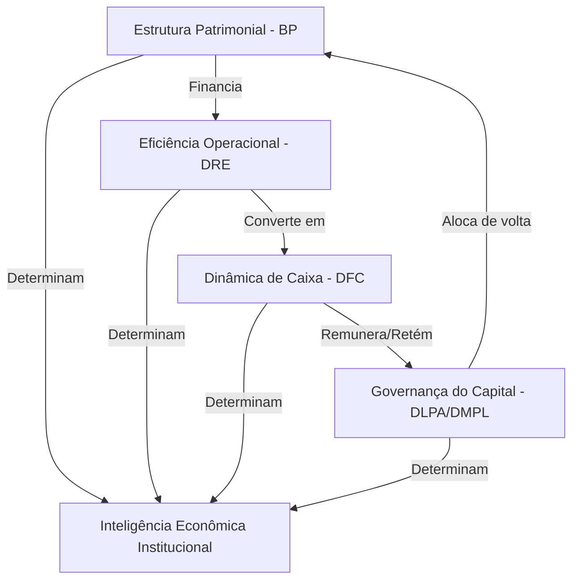

# Architectural Foundation Document: Executive Financial Operating System (EFOS)
**Illumine Platform Core Ontology & Governance Architecture**

---

## 1. Introdução Filosófica

### 1.1 A Insuficiência das Demonstrações Isoladas
Demonstrações contábeis e financeiras tradicionais — como o Balanço Patrimonial (BP), a Demonstração do Resultado do Exercício (DRE) e a Demonstração dos Fluxos de Caixa (DFC) — são historicamente consumidas de forma fragmentada. Essa segregação induz a erros interpretativos críticos. Um Balanço Patrimonial robusto em ativos pode ocultar uma DRE sob severa asfixia de margens; uma DRE com crescimento acelerado de receita e EBITDA pode mascarar uma DFC com queima crônica de caixa operacional devido à ineficiência no ciclo de capital de giro. 

O capital de uma entidade empresarial não é estático nem segmentado; ele é um fluido dinâmico que percorre a estrutura corporativa. Interpretar um único demonstrativo de forma isolada equivale a diagnosticar a saúde de um organismo analisando apenas um de seus sistemas vitais.

### 1.2 O Fracasso dos Dashboards Tradicionais (Analytics vs. Reporting vs. EFOS)
Os painéis de Business Governance (BI) e dashboards tradicionais falham no ambiente executivo porque se limitam a fazer **reporting** ou **analytics** descritivos:
* **Reporting**: Consolida e exibe dados históricos de forma tabular ou visualizada. Diz *o que* aconteceu.
* **Analytics**: Permite filtros, drill-downs e comparações numéricas. Permite visualizar *onde* aconteceu.
* **Executive Financial Operating System (EFOS)**: Interpreta o *significado fiduciário* e a *causalidade econômica* das interações entre a estrutura de capital, o desempenho operacional e o fluxo de caixa. O EFOS traduz números em teses de governança executiva orientadas a evidências causais, protegendo o Board contra conclusões frágeis e ilusões de liquidez.

```
┌─────────────────────────────────────────────────────────────┐
│                       ILLUMINE EFOS                         │
├───────────────┬─────────────────────────────────────────────┤
│  Estrutura    │ Como o capital está financiado? (BP)         │
│  Geração      │ A operação gera resultado sustentável? (DRE)│
│  Conversão    │ O resultado se converte em caixa? (DFC)      │
│  Retenção     │ O capital é preservado ou drenado? (DLPA)    │
│  Eficiência   │ O modelo econômico cria valor real? (EVA)   │
└───────────────┴─────────────────────────────────────────────┘
```

---

## 2. Ontologia Financeira Institucional

A ontologia do EFOS organiza as dimensões econômicas da corporação em cinco pilares interconectados, cada um respondendo a uma indagação executiva fundamental.



### 2.1 Estrutura Patrimonial (BP)
* **Pergunta Central**: *“Como a operação está financiada?”*
* **Escopo e Responsabilidades**: Avaliar a solidez da base de capital, o grau de endividamento sobre recursos próprios, a adequação dos prazos de vencimento dos passivos exigíveis em relação à liquidez dos ativos, e a alocação de recursos em capital de giro ou ativos permanentes.
* **Subdimensões**: Liquidez (Corrente, Seca, Imediata), Autonomia Financeira, Necessidade de Capital de Giro (NCG), Pressão Patrimonial e Qualidade Estrutural do Capital (relação entre passivos financeiros onerosos e patrimônio líquido).

### 2.2 Eficiência Operacional (DRE)
* **Pergunta Central**: *“A operação gera resultado econômico sustentável?”*
* **Escopo e Responsabilidades**: Auditar a capacidade da operação de gerar margens saudáveis a partir do faturamento, medir o ponto de equilíbrio operacional e avaliar a escalabilidade da estrutura de custos e despesas fixas (SG&A).
* **Subdimensões**: Margem de Contribuição, Ponto de Equilíbrio (Break-even), Margem EBITDA, Margem Líquida, Capacidade de Absorção da Estrutura Fixa e Escalabilidade (YoY real de custos vs. receita).

### 2.3 Dinâmica de Caixa (DFC)
* **Pergunta Central**: *“O resultado econômico se converte em caixa real?”*
* **Escopo e Responsabilidades**: Analisar o fluxo de caixa proveniente das atividades operacionais (FCO), identificando se a geração de EBITDA está sendo consumida por variações de capital de giro (NCG) ou se de fato se converte em caixa livre.
* **Subdimensões**: Saldo de Tesouraria, Ciclo Financeiro de Conversão, Geração de Caixa Livre (FCF), Cobertura do Serviço da Dívida (DSCR) e Pressão / Ruptura de Curto Prazo (Runway).

### 2.4 Governança do Capital (DLPA/DMPL)
* **Pergunta Central**: *“O capital é preservado ou drenado?”*
* **Escopo e Responsabilidades**: Auditar a destinação dos lucros gerados pela operação, monitorando a disciplina de retenção de reservas para reinvestimento vs. distribuição de dividendos/JCP, transações com partes relacionadas (sócios) e recomposição patrimonial.
* **Subdimensões**: Taxa de Retenção de Lucros, Alinhamento de Partes Relacionadas (Mútuos), Governança Fiduciária de Distribuição e Maturidade Fiduciária do Capital Próprio.

### 2.5 Inteligência Econômica Institucional
* **Pergunta Central**: *“O modelo econômico cria valor sustentável acima do custo de oportunidade?”*
* **Escopo e Responsabilidades**: Sintetizar o retorno sobre o capital investido ajustado pelas premissas setoriais e pelo custo de capital dos sócios.
* **Subdimensões**: Retorno sobre Capital Investido (ROIC), Valor Econômico Adicionado (EVA), Eficiência de Alocação de Capex e Sustentabilidade do crescimento de longo prazo.

---

## 3. Arquitetura de Orquestração

Para evitar contradições interpretativas e consolidar uma visão executiva unificada, o EFOS é orquestrado por quatro motores acoplados que atuam no runtime:

```
                  ┌──────────────────────────────────────────────┐
                  │      Institutional Financial Thesis Engine   │
                  └──────────────┬────────────────┬──────────────┘
                                 │                │
     ┌───────────────────────────▼───┐        ┌───▼───────────────────────────┐
     │  Cross Statement Causality    │        │  Executive Narrative          │
     │  Engine                       │        │  Orchestrator                 │
     └───────────────────────────┬───┘        └───┬───────────────────────────┘
                                 │                │
                                 └────────┬───────┘
                                          │
                                 ┌────────▼───────────────────────────┐
                                 │  Executive Priority Consolidation  │
                                 │  Engine                            │
                                 └────────────────────────────────────┘
```

### 3.1 Institutional Financial Thesis Engine
O motor central de conciliação de teses. Ele recebe os relatórios brutos de Balanço, DRE e Fluxo de Caixa e garante a integridade fiduciária global. Ele impede contradições lógicas, tais como emitir um parecer de "Crescimento Saudável" quando há erosão estrutural do capital próprio ou assinalar "Margens Excelentes" sem auditar a suficiência da capacidade de absorção das despesas fixas.

### 3.2 Cross Statement Causality Engine
Responsável pelo rastreamento causal inter-demonstrativos. Ele mapeia as relações de causa e efeito que cruzam as demonstrações financeiras. Por exemplo: detecta que a causa raiz de um estresse de tesouraria imediata (DFC) reside no aumento excessivo dos prazos de contas a receber de clientes (BP) combinado com a redução de margem bruta operacional (DRE).

### 3.3 Executive Narrative Orchestrator
Garante o alinhamento semântico institucional da plataforma. Ele atua como um compilador textual que traduz termos técnicos agressivos ou enums brutos em termos corporativos sofisticados em língua portuguesa, respeitando o princípio da prudência e as limitações de confiança de dados detectadas.

### 3.4 Executive Priority Consolidation Engine
Responsável pela repriorização da matriz de recomendações estratégicas. Ele analisa as prioridades geradas individualmente pelos indicadores e as consolida sob uma única agenda hierárquica. Esse motor impede prioridades concorrentes ou incoerentes (como sugerir a expansão comercial e, simultaneamente, o congelamento imediato de despesas operacionais comerciais).

---

## 4. KPI Semantic Governance

Os indicadores no EFOS não operam como simples exibições numéricas acompanhadas de sinais lógicos binários (maior/menor). Cada KPI é enriquecido contextualmente pelo modelo setorial da empresa e pelas restrições de governança corporativa.

### 4.1 Princípio do Enriquecimento Semântico
Métricas brutas sem contexto não geram inteligência. O sistema correlaciona a métrica à estrutura de capital, ao estágio operacional e ao segmento de mercado da entidade.

### 4.2 Exemplo Obrigatório de Tradução Semântica

* **Antes (Analytics Tradicional)**:
  > *"Margem Bruta = 55%"*

* **Depois (Illumine EFOS Semantic Governance)**:
  > *"A margem bruta de 55.0% encontra-se acima do benchmark de referência esperado de 48.0% para operações industriais do segmento de Cosméticos. Esta performance sugere viabilidade comercial robusta em termos de precificação e custos variáveis diretos, embora a margem atual permaneça insuficiente para absorver a pesada estrutura de despesas fixas administrativas instalada no presente ciclo (gerando um déficit de cobertura operacional de 15.2%)."*

---

## 5. Benchmark Governance Model

A Illumine adota um modelo rígido de governança e linhagem de referências setoriais, garantindo que o Board visualize o grau de certeza de cada alvo comparativo apresentado.

### 5.1 Hierarquia de Referências e Níveis de Confiança
1. **Board Custom KPI (`HIGH_CONFIDENCE`)**: Metas financeiras e operacionais inseridas e regulamentadas diretamente pelo Conselho de Administração da entidade. Possuem precedência máxima e representam metas técnicas definitivas.
2. **Registered Sector Benchmark (`MEDIUM_CONFIDENCE`)**: Índices comparativos setoriais homologados e originados de bases estatísticas oficiais da indústria onde a empresa está cadastrada.
3. **Generic Economic Model Benchmark (`LOW_CONFIDENCE`)**: Valores de referência inferidos pelo modelo macroeconômico básico correspondente (SaaS, Serviço, Indústria, etc.) quando não há cadastro de benchmark setorial específico. Estes indicadores devem carregar explicitamente o rótulo: *(Referencial aproximado para [modelo], não aplicável como meta técnica definitiva)*.
4. **Undefined Reference (`UNAVAILABLE`)**: Ausência de referência qualificada. Nenhuma estimativa arbitrária é permitida; a meta deve ser marcada como indisponível.

### 5.2 Rastreabilidade e Provenance
Toda referência comparativa exibida em relatórios de board, gráficos e tabelas de eficiências deve conter a indicação clara de sua linhagem (`benchmarkOrigin`) e nível de confiança no metadado, garantindo auditabilidade total por comitês de governança.

---

## 6. Fail-Closed Philosophy

O princípio central de design técnico do EFOS determina que **a ausência de dados, o erro contábil ou a inconsistência de séries históricas devem forçar um bloqueio de exibição (fail-closed)**, em vez de gerar dados aproximados ou stubs arbitrários.

### 6.1 Estados Institucionais Oficiais no Runtime

```
┌─────────────────────────┬────────────────────────────────────────────────────────────┐
│ Estado Oficial          │ Gatilho e Comportamento no Runtime                         │
├─────────────────────────┼────────────────────────────────────────────────────────────┤
│ NOT_AVAILABLE           │ Métrica impossível de calcular por falta de conta          │
│                         │ estrutural necessária.                                     │
├─────────────────────────┼────────────────────────────────────────────────────────────┤
│ INSUFFICIENT_DATA       │ Ausência completa de datasets obrigatórios (ex: sem DRE).  │
├─────────────────────────┼────────────────────────────────────────────────────────────┤
│ EMPTY_CYCLE             │ Bloqueio completo de score, gráficos e diagnóstico quando  │
│                         │ não há lançamentos contábeis no exercício.                 │
├─────────────────────────┼────────────────────────────────────────────────────────────┤
│ HISTORICAL_LIMITATION   │ Bloqueio de gráficos e análises evolutivas YoY quando a    │
│                         │ série histórica é inferior a 2 ciclos.                     │
├─────────────────────────┼────────────────────────────────────────────────────────────┤
│ INVALID_CALCULATION     │ Tratamento de divisões por zero, NaN ou Infinity. Exibe    │
│                         │ "Estrutura não comparável" ou "Não aplicável".             │
└─────────────────────────┴────────────────────────────────────────────────────────────┘
```

A plataforma prefere a omissão técnica clara e fiduciariamente justificada à exibição de inferências de inteligência baseadas em informações inexistentes ou corrompidas.

---

## 7. Executive Experience Model

A experiência de navegação do Board Pack e dos dashboards executivos da Illumine é projetada para contar uma história estruturada e lógica do comportamento do capital, orientando a tomada de decisão a partir da verdade fiduciária dos dados.

### 7.1 O Fluxo Narrativo da Home Executiva

```
   ┌─────────────────────────────────────────────────────────────┐
   │ 1. INSTITUTIONAL FINANCIAL THESIS                           │
   │ Parecer e tese de governança fiduciária consolidada         │
   └───────────────┬─────────────────────────────────────────────┘
                   │
   ┌───────────────▼─────────────────────────────────────────────┐
   │ 2. ESTRUTURA PATRIMONIAL                                    │
   │ Autonomia, solvência e fontes de financiamento (BP)         │
   └───────────────┬─────────────────────────────────────────────┘
                   │
   ┌───────────────▼─────────────────────────────────────────────┐
   │ 3. EFICIÊNCIA OPERACIONAL                                   │
   │ Geração econômica, margens e ponto de equilíbrio (DRE)      │
   └───────────────┬─────────────────────────────────────────────┘
                   │
   ┌───────────────▼─────────────────────────────────────────────┐
   │ 4. DINÂMICA DE CAIXA                                        │
   │ Ciclo operacional, runway e conversão de caixa (DFC)        │
   └───────────────┬─────────────────────────────────────────────┘
                   │
   ┌───────────────▼─────────────────────────────────────────────┐
   │ 5. GOVERNANÇA DO CAPITAL                                    │
   │ Destinação de lucros, mútuos e partes relacionadas (DLPA)   │
   └───────────────┬─────────────────────────────────────────────┘
                   │
   ┌───────────────▼─────────────────────────────────────────────┐
   │ 6. INTELIGÊNCIA ECONÔMICA INSTITUCIONAL                     │
   │ ROIC, EVA e eficiência global do modelo de capital          │
   └─────────────────────────────────────────────────────────────┘
```

### 7.2 Princípios de UX Institucional
- **Causalidade Visual**: Informações táticas e cards de métricas estão sempre conectados ao seu contexto causador.
- **Continuidade Executiva**: A navegação da página de visão geral para as visões detalhadas (BP, DRE, Fluxo de Caixa) deve preservar os parâmetros de contextualização (ano, modelo econômico, nível de confiança).

---

## 8. Governança Epistemológica

O EFOS segue regras estritas de integridade científica e prudência corporativa no processamento analítico:

* **IA Opinativa Banida**: É proibido que qualquer motor de inferência emita julgamentos subjetivos ou adjetivações excessivas sobre a conduta pessoal de executivos. O EFOS atesta fatos numéricos e comportamentos econômicos estruturais.
* **Proibição de Psicologia Organizacional**: A plataforma não infere causas comportamentais ou motivacionais (ex: *"A equipe de vendas está desmotivada"*). O diagnóstico foca exclusivamente nas evidências contábeis e transacionais tangíveis (ex: *"O prazo médio de recebimento de clientes aumentou de 32 para 48 dias no trimestre"*).
* **Causalidade Determinística Restrita**: Nenhuma correlação fortuita é tratada como causalidade direta. Relações temporais são mapeadas como "Associação Recorrente" ou "Precedência Temporal", nunca como causalidade absoluta sem evidência lógica de fluxo de capital.

---

## 9. Lineage & Auditability

Toda informação e conselho gerado pela plataforma possui um rastro lógico imutável, permitindo auditorias minuciosas.

### 9.1 Evidence Lineage
Todo item contido na Matriz Executiva de Ações deve carregar a sua respectiva evidência contábil-financeira correspondente, extraída do balanço do período. Se uma ação propõe a redução de despesas fixas, ela deve expor a fração percentual de SG&A sobre a receita líquida e o valor absoluto correspondente no período.

### 9.2 Benchmark Lineage
As metas comparativas de mercado e okrs industriais são rastreadas desde o banco de benchmarks homologado até a sua origem setorial, identificando a fonte das premissas e a data de atualização.

### 9.3 Propagation Lineage
O contágio de riscos econômicos entre empresas de um mesmo grupo econômico (consolidação de holdings) deve mapear detalhadamente a topologia das entidades e os vetores de estresse, atestando quais dependências financeiras ou comerciais interligam as subsidiárias.

---

## 10. Positioning & Category Definition

Para posicionar corretamente a Illumine nos comitês de tomada de decisão e conselhos das companhias, a plataforma é classificada estritamente sob as seguintes definições:

* **O que a Illumine NÃO é**:
  - **ERP (Enterprise Resource Planning)**: Não operamos no nível de processamento transacional de compras, vendas, estoque ou faturamento diário.
  - **BI (Business Governance)**: Não somos uma tela em branco para construção de gráficos ad-hoc baseados em consultas SQL arbitrárias.
  - **Dashboard Financeiro / Reporting AI**: Não nos limitamos a resumir planilhas de forma estática ou com linguagem genérica orientada por IA generativa sem regras fiscais rígidas.

* **O que a Illumine É**:
  - **Institutional Financial Operating System (EFOS)**: O sistema de governança de capital que unifica a contabilidade analítica, a causalidade econômica e o aconselhamento fiduciário em uma única plataforma auditável e resiliente para o Conselho de Administração e Liderança Executiva.
