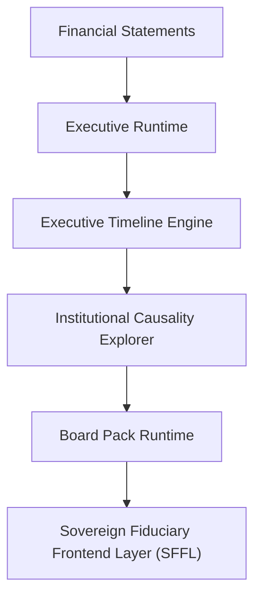

# Constitutional Specification — Institutional Causality Explorer (ICE) v1.0

## Purpose

The Institutional Causality Explorer (ICE) exists to identify and explain deterministic cause-and-effect relationships between validated institutional symptoms and their probable structural drivers.

The ICE is **not** a prediction engine.

The ICE is **not** an AI reasoning engine.

The ICE is **not** a recommendation engine.

The ICE is a deterministic causal interpretation layer operating exclusively on validated runtime outputs.

---

## Constitutional Objective

Traditional dashboards explain:
> “What happened?”

The Executive Timeline Engine explains:
> “What has been happening over time?”

The Institutional Causality Explorer explains:
> “Why is it happening?”

---

## Constitutional Position

The ICE operates after Runtime and Timeline generation.

Approved architecture:


The ICE may consume:
* Runtime outputs
* Timeline outputs
* Certified KPIs
* Governance classifications

The ICE may **not** consume:
* Raw accounting transactions
* Manual explanations
* User-generated narratives

---

## Principle 1 — Deterministic Causality

Every causal conclusion must originate from explicit rules.
* No probabilistic inference.
* No AI-generated reasoning.
* No statistical guessing.
* Every causal chain must be reproducible.

---

## Principle 2 — Symptom-to-Cause Mapping

The ICE exists to connect:
```
Symptoms
   ↓
Drivers
   ↓
Root Causes
```

Example:
```
Negative FCO
   ↓
Working Capital Pressure
   ↓
Inventory Expansion
```
The chain must remain explainable.

---

## Principle 3 — Explainability First

Every causal relationship must expose:
* Triggering evidence
* Supporting metrics
* Source periods
* Confidence level
* Lineage hash

No hidden reasoning is permitted.

---

## Principle 4 — Root Cause Priority

The ICE shall prioritize structural causes over superficial symptoms.

* **Non-Compliant Example**:
  `Revenue ↓ → Problem`
* **Compliant Example**:
  `Customer Concentration → Revenue Volatility → Margin Compression → EBITDA Deterioration`

---

## Principle 5 — Multi-Layer Causality

The ICE may classify causes into layers:
* Operational
* Financial
* Treasury
* Governance
* Capital Structure
* Constitutional

This allows executives to distinguish operational failures from fiduciary failures.

---

## Principle 6 — Confidence Discipline

Causal confidence depends on:
* Data completeness
* Historical depth
* Runtime consistency
* Lineage continuity

The ICE must never express certainty without evidence.

---

## Principle 7 — Fail Closed

The ICE must fail closed when:
* Evidence is insufficient
* Runtime outputs are unavailable
* Historical continuity is broken
* Lineage validation fails

The engine shall emit `CAUSALITY_RESTRICTED` instead of speculative explanations.

---

## Principle 8 — No Recommendations

The ICE explains causes. The ICE does not prescribe actions.

* **Allowed**:
  > “Working capital pressure is primarily associated with inventory expansion.”
* **Forbidden**:
  > “Reduce inventory by 20%.”

Recommendations belong to separate governance layers.

---

## Principle 9 — Constitutional Awareness

The ICE may identify constitutional drivers.

Examples:
* Governance restriction
* Constitutional quarantine
* Fiduciary enforcement
* Assurance reconstruction

These are valid causal events.

---

## Principle 10 — Executive Simplicity

Despite internal complexity, outputs must remain understandable by:
* Board members
* Investors
* Auditors
* Executives

Causality should reduce complexity, not increase it.

---

## Approved Causal Categories

* Operational Cause
* Commercial Cause
* Treasury Cause
* Working Capital Cause
* Debt Cause
* Governance Cause
* Capital Structure Cause
* Constitutional Cause

---

## Approved Outputs

`InstitutionalCausalityOutput` contains:
* `primaryCause`
* `secondaryCauses`
* `causalChains`
* `confidenceLevel`
* `supportingEvidence`
* `executiveNarrative`
* `lineageHash`

---

## Approved Causal Chain Structure

```
Cause
  ↓
Intermediate Driver
  ↓
Observed Effect
```

Example:
```
Inventory Expansion
  ↓
Working Capital Consumption
  ↓
Cash Flow Deterioration
```

---

## Constitutional Classification

The Institutional Causality Explorer is classified as:
> **CAUSAL_INTELLIGENCE_LAYER**

and shall **never** become:
* `PREDICTION_ENGINE`
* `DECISION_ENGINE`
* `AI_REASONING_ENGINE`

without formal constitutional amendment.

---

## Success Criterion

A board member reading a Governance report should be able to answer:
1. “What happened?”
2. “What has been happening?”
3. “Why is it happening?”

without requiring access to raw accounting statements.
