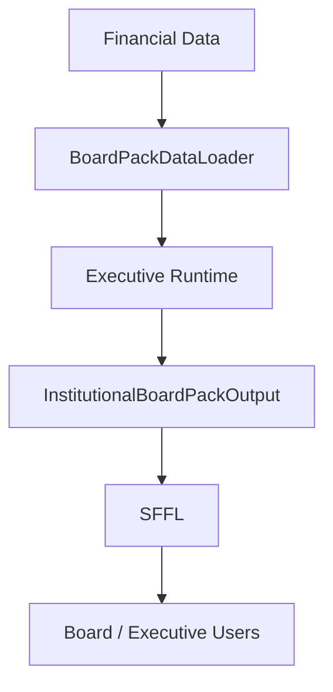

# Constitutional Specification — Sovereign Fiduciary Frontend Layer (SFFL)

## Purpose

The Sovereign Fiduciary Frontend Layer (SFFL) exists to expose fiduciary conclusions generated by the Governance Runtime without introducing local calculations, interpretations, thresholds, classifications, or business rules.

* The SFFL is a **disclosure layer**.
* It is **not** an analytical layer.
* It is **not** a decision engine.
* It is **not** a governance engine.

All institutional governance originates exclusively from the Runtime Layer.

---

## Constitutional Principles

### Principle 1 — Runtime Supremacy
All fiduciary classifications, confidence evaluations, governance restrictions, causal interpretations, survivability assessments, constitutional enforcement actions, and lineage generation must be computed exclusively by the Runtime.

The frontend is prohibited from creating or modifying institutional conclusions.

### Principle 2 — Passive Rendering
Frontend components may:
* Render values.
* Render classifications.
* Render disclosures.
* Render lineage.
* Render executive narratives.

Frontend components may not:
* Calculate KPIs.
* Infer severity.
* Derive confidence.
* Generate recommendations.
* Reclassify outputs.

### Principle 3 — Fail Closed Visibility
Whenever the Runtime reports:
* `FAIL_CLOSED`
* `CONSTITUTIONAL_QUARANTINE`
* `EXECUTION_FAILED`

the SFFL must immediately suspend executive disclosure.
* No financial conclusions may be rendered.
* The reason for restriction must remain visible.

### Principle 4 — Institutional Disclosure Integrity
Every executive statement exposed by the interface must be traceable to runtime output.
* No UI-generated narrative is permitted.
* Narrative authority belongs exclusively to runtime engines.

### Principle 5 — Lineage Transparency
The SFFL must expose lineage information whenever available.

Minimum disclosure:
* Board Pack Lineage Hash
* Runtime Hashes
* Propagation Hashes
* Evidence Counts
* Disclosure References

Lineage information is read-only.

### Principle 6 — Mock Isolation
Mock data exists exclusively for:
* Demonstrations
* UI Validation
* Development
* Testing

Mock outputs must never be visually indistinguishable from institutional outputs.

Required controls:
* MOCK banner
* `MOCK_LINEAGE` identifier
* Explicit disclosure warning

### Principle 7 — Data Loader Separation
Data acquisition responsibilities belong exclusively to dedicated loaders.
* Rendering components may not directly query databases.

Approved flow:
```
Firestore ➔ BoardPackDataLoader ➔ Executive Runtime ➔ InstitutionalBoardPackOutput ➔ SFFL
```

### Principle 8 — Contract Stability
The SFFL consumes only:
```typescript
interface SovereignBoardPackContract {
  boardPack: InstitutionalBoardPackOutput;
  dataMode: 'REAL' | 'MOCK' | 'EMPTY' | 'ERROR';
}
```
No runtime internals may be exposed to presentation components.

### Principle 9 — Constitutional Non-Interference
The frontend may never override:
* Runtime conclusions
* Constitutional restrictions
* Fiduciary quarantines
* Governance enforcement actions
* Confidence levels

Runtime authority is absolute.

### Principle 10 — Executive Explainability
The SFFL exists to improve executive understanding while preserving analytical integrity.

Every visible conclusion must remain:
* Deterministic
* Explainable
* Auditable
* Reproducible
* Traceable

without introducing interpretative behavior into the presentation layer.

---

## Approved Architectural Flow



---

## Constitutional Status

SFFL is classified as:

$$\text{DISCLOSURE\_LAYER}$$

and shall never be elevated to:
* `ANALYTICS_LAYER`
* `GOVERNANCE_ENGINE`
* `DECISION_ENGINE`

without formal constitutional revision.
