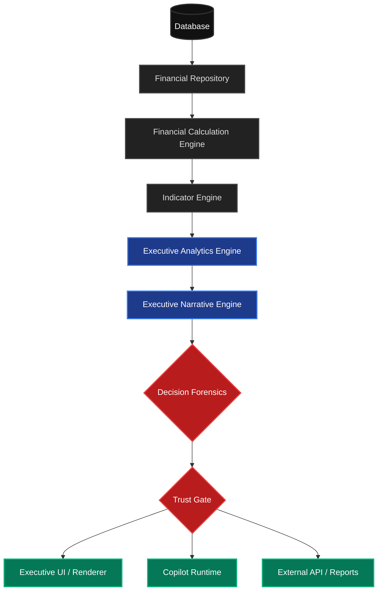

# Executive Analytics Data Lineage

Este documento estabelece a topologia oficial (Phase 1 / BI-001) de como a informação flui da persistência até a experiência do usuário final, garantindo rastreabilidade e governança ao longo de todo o pipeline.

## Topologia Oficial do Fluxo de Valor Analítico

O diagrama a seguir descreve a cadeia oficial de processamento, onde nenhuma camada pode saltar uma etapa ou acessar diretamente níveis inferiores sem autorização constitucional.

## Descrição das Camadas

1. **Database:** Persistência dos dados brutos e mutáveis.
2. **Financial Repository:** Abstração de acesso a dados. Garante que os dados sejam buscados considerando o Tenant, Período e Workspace corretos.
3. **Financial Calculation Engine:** Camada matemática pura (ex: `Ativo = Circulante + Não Circulante`). Não entende o negócio, apenas a matemática financeira e contábil.
4. **Indicator Engine:** Calcula KPIs estruturados a partir das abstrações financeiras (ex: `Liquidez Corrente = Ativo Circulante / Passivo Circulante`).
5. **Executive Analytics Engine:** O cérebro corporativo. Interpreta os indicadores através de *Capabilities* (Liquidez, Endividamento) e produz um `ExecutiveAnalyticsResult` tipado. Não se comunica com UI ou gera textos diretamente.
6. **Executive Narrative Engine:** Traduz os achados analíticos brutos (JSON) em linguagem natural executiva ou estruturas de comunicação (Português, Inglês, foco Board, foco Banco).
7. **Decision Forensics & Trust Gate:** Guardiões cognitivos. Validam a integridade, amarram a cadeia de evidência aos dados originadores e bloqueiam alucinações (AI) ou distorções antes de chegar ao usuário.
8. **UI / Copilot:** Os consumidores. Renderizam as narrativas certificadas (UI) ou formulam respostas baseadas nos insights filtrados (Copilot). Nenhuma inferência ou cálculo ocorre aqui.
