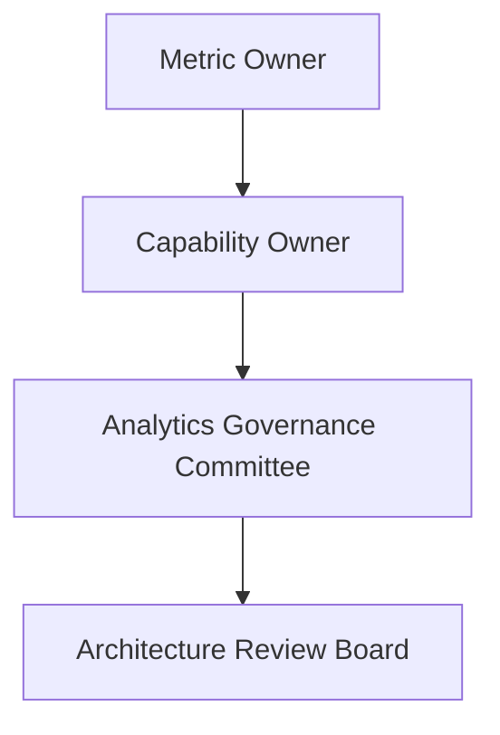

# Executive Analytics Ownership Model

A constituição analítica determina categoricamente que "Todo cálculo possui um único owner". Este documento formaliza o modelo operacional dessa propriedade e as leis de alteração sobre a inteligência da plataforma.

## A Hierarquia de Autoridade Analítica

O fluxo de autoridade que governa a criação, modificação e versão da inteligência segue a seguinte cadeia estrita:

### 1. Metric Owner (Autor da Fórmula)
* **Perfil Técnico/Negócios:** Analista Quântico, Engenheiro Financeiro.
* **Responsabilidade:** Definir o mapeamento matemático de uma métrica bruta (ex: `Liquidez = Ativo / Passivo`).
* **Direitos:** Propõe a criação ou ajuste de fórmulas no *Financial Calculation Engine*. Não possui permissão para publicá-las sem revisão superior.

### 2. Capability Owner (Guardião do Domínio)
* **Perfil Técnico/Negócios:** Tech Lead, Especialista de Domínio (ex: Squad de Risco Fiduciário).
* **Responsabilidade:** Agrupar métricas matematicamente puras para construir um julgamento (ex: `LiquidityCapability`). Define os limites (limiares/thresholds) que separam "Saudável" de "Crítico".
* **Direitos:** Aprova a inclusão de métricas dentro de sua *Capability*. Responsável direto caso a *Capability* emita um laudo corrompido ou irreal sobre um Tenant.

### 3. Analytics Governance Committee (Comitê Tático)
* **Responsabilidade:** Auditar se a nova Capability ou ajuste métrico atende à *Analytics Purity* e possui tipagem compatível com a *Evidence Chain*.
* **Direitos:** Emite o selo *'Pending'* no Contract Registry após aprovar a arquitetura semântica.

### 4. ARB (Architecture Review Board)
* **Responsabilidade:** Guardiões máximos do *Executive Analytics Engine*.
* **Direitos:** Apenas o ARB pode migrar um status do Contract Registry de `Pending` para `Certified`. O ARB possui poder de veto universal sobre qualquer inferência analítica proposta que fira a *Migration Constitution*.

## Regras de Versionamento de Fórmulas

Mudar uma fórmula financeira retroativamente distorce históricos. 

1. **Imutabilidade:** Fórmulas já certificadas e ativas em relatórios consolidados não devem ser alteradas (*in-place substitution*).
2. **Nova Capability/Métrica:** Ajustes radicais em cálculos de negócio (ex: mudar o entendimento base do que compõe um DRE) exigem a emissão de uma nova métrica (ex: `EBITDA_V2`) ou nova Capability.
3. **Traceability:** O campo `engineVersion` dentro da *Evidence Chain* garantirá que análises geradas em `2025` sob a versão `1.0` da fórmula possam ser auditadas contra o repositório histórico exato daquele momento, impedindo quebra de confiabilidade retroativa.
