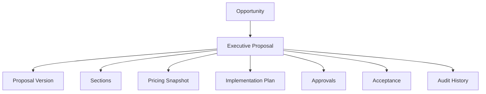

# Wave 18B.0 — Executive Proposal Workspace Discovery & Architecture

## 1. Propósito
O **Executive Proposal Workspace™** não é uma simples página de proposta em PDF exportado ou um formulário comercial. É um **ambiente executivo privado** (digital room) altamente premium e interativo. Ele materializa a oferta de valor da Illumine, permitindo que a negociação comercial ocorra com a mesma densidade analítica e governança visual que os módulos internos do Executive OS.

## 2. Jornada

### Illumine Revenue Team
- **Pode:** Criar, editar, aprovar internamente e enviar propostas.
- **Jornada:** Preenche dados analíticos do cliente (Diagnóstico), acopla os módulos (Executive Offices) da solução e orquestra o preço baseado na Platform Pricing Engine.

### Advisor (Parceiro)
- **Pode:** Preparar rascunhos para sua carteira, personalizar narrativas e acompanhar engajamento.
- **Jornada:** Recebe a oportunidade qualificada, formata o workspace da proposta com os dados do cliente e monitora o *View Audit Trail* (quando o cliente abriu, qual seção mais leu).

### Customer (Cliente / C-Level)
- **Pode:** Visualizar (com link seguro autenticado), adicionar comentários/dúvidas, negociar condições e realizar o Aceite Digital.
- **Jornada:** Recebe o token seguro, valida a identidade (OTP ou Login), consome a narrativa estratégica e aciona o Aceite Digital, engatilhando o faturamento.

## 3. Modelo de Dados da Proposta

*O `Pricing Snapshot` congela as regras de negócio no momento do envio, garantindo que mudanças globais de preço não alterem propostas em andamento.*

## 4. Proposal Lifecycle (Estados)
Todo o ciclo de vida deve ser rastreado e auditável:
`Draft` ➔ `Internal Review` ➔ `Approved` ➔ `Published` ➔ `Viewed` ➔ `Negotiation` ➔ `Accepted` ➔ `Rejected` ➔ `Expired`

## 5. Permissões de Acesso (RBAC)
- **`revenue_manager`**: Full write nas tabelas de propostas dentro da `revenue_platform`.
- **`advisor`**: Read/Write restrito ao seu portfólio (filtro por `advisor_id`).
- **`customer`**: Read-only via Access Token gerado no momento do `Published`. Apenas permissão de gravação no payload de `Acceptance`.

## 6. UX Architecture (A Sala Digital)
O workspace consolida as seguintes sessões de navegação:
1. **Overview & Hero:** Posicionamento executivo, ganhos esperados, branding do cliente em harmonia com a Illumine.
2. **Current Situation & Diagnóstico:** Dores, fricções atuais e contexto capturado na qualificação.
3. **Strategic Opportunity & Executive Vision:** Como os Executive Offices endereçam a situação atual.
4. **Proposed Solution:** Mapeamento de Capabilities, Módulos (Governance, Financial, etc.) inclusos.
5. **Implementation Journey:** Timeline, onboarding e responsáveis (milestones).
6. **Investment & Terms:** Plano escolhido, limits, valores, SLAs, compliance e SLA de infraestrutura.
7. **Acceptance & Next Steps:** Botão de aceite digital rastreável e direcionamento para faturamento.

## 7. Component Mapping (Reaproveitamento do Design System)

Após auditoria na pasta `src/components/ui/`, foram identificados os blocos construtivos exatos para não criarmos componentes do zero:

*   **Layout:** Utilizaremos um derivado do `InstitutionalLayout.tsx` adaptado para ambiente privado (`ExecutiveWorkspaceLayout`).
*   **Hero / Headings:** `ExecutiveHeading`, `ExecutiveTypography`, `PageHeader`.
*   **Current Situation (Tensions):** Reutilização de `ExecutiveStrategicTensions`, `ExecutiveConflictCard`, `ExecutiveRiskCard` e `ExecutiveExposureCard`.
*   **Solution & Capabilities:** `ExecutiveAccordion` para módulos, `ExecutiveSummaryCard`, `ExecutiveEvidenceGrid`.
*   **Investment & Analytics:** `ExecutiveMetricCard`, `ExecutiveChartInsight` para desenhar o ROI (se aplicável), e `ExecutiveTable` para cronograma de pagamentos.
*   **Implementation Journey:** `ExecutiveLineageTimeline` adaptado para cronograma.
*   **Status & Feedback:** `ExecutiveStatusBadge`, `StatusBadge`, `ExecutiveVerdictCard`.
*   **Audit & Signatures:** Utilização de `ExecutiveDecisionTrace` para renderizar as aprovações e o aceite digital.

## 8. i18n Strategy
Nascer 100% internacionalizado, abolindo strings hardcoded.
*   **Idiomas Suportados:** `pt-BR`, `en-US`, `es-ES`.
*   **Namespaces:**
    *   `proposal.json` (Textos estruturais, botões, cabeçalhos)
    *   `proposal_sections.json` (Títulos de seções, call-to-actions)
    *   `proposal_acceptance.json` (Termos de serviço, declarações legais de aceite)
    *   `proposal_status.json` (Labels para o ciclo de vida: Published, Expired)

## 9. Security Model
Absolutamente **NENHUM link público ou aberto**.
1. **Proposal Access Token:** A proposta gera um hash cryptográfico temporário com expiração (ex: válido por 14 dias).
2. **Identity Validation:** O cliente recebe o link mágico. Ao abrir, insere seu e-mail de contato corporativo (que consta na oportunidade) para validar ou recebe um OTP.
3. **Workspace Access:** O layout renderiza a proposta.
4. **Audit Event:** Qualquer acesso via token registra o IP, Timestamp e Sessão no `Audit History` da proposta, permitindo ao Advisor saber que o prospect "abriu a proposta".

## 10. Implementation Roadmap (Wave 18B)
A execução será quebrada nas seguintes fases (Subwaves), para redução contínua de risco:

- **18B.1 — Foundation & Data Model:** Schema das tabelas de proposta e versão, além do isolamento de segurança.
- **18B.2 — Proposal Builder:** Ferramenta interna (para Illumine/Advisors) comporem o conteúdo.
- **18B.3 — Client Workspace Experience:** A renderização externa rica da proposta utilizando os componentes executivos.
- **18B.4 — Approval Workflow:** O fluxo de validação interna antes de enviar (`Internal Review -> Approved -> Published`).
- **18B.5 — Digital Acceptance:** O clique criptográfico e auditoria de aceite pelo C-Level.
- **18B.6 — Revenue Integration:** Disparo do evento `ProposalAccepted` que ativa o `ContractGeneration` e transaciona o faturamento.
